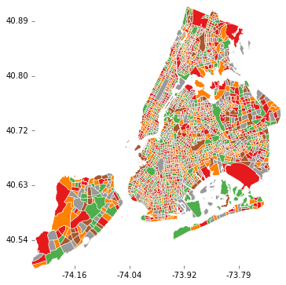
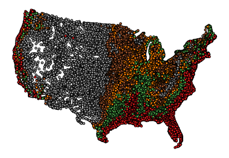

### Quickstart

`geoplot` is an in-progress, very early-iteration library for high-level geographic data visualization, akin to
`seaborn`. It is based on `cartopy`, `geopandas`, and the rest of the modern geospatial Python stack.

Here are a few teasers of what it can do:

### Status

WIP.

#### References

* http://geoffboeing.com/2016/11/osmnx-python-street-networks/
* http://seaborn.pydata.org/api.html
* http://scitools.org.uk/cartopy/docs/latest/gallery.html
* http://darribas.org/gds_scipy16/ipynb_md/02_geovisualization.html

### To-do

Tons.
