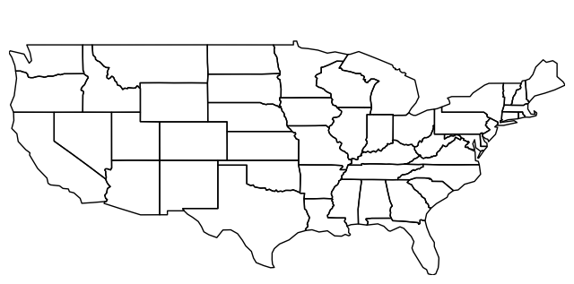
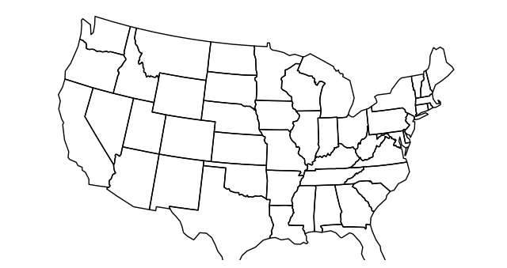
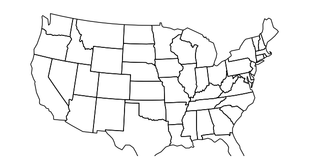
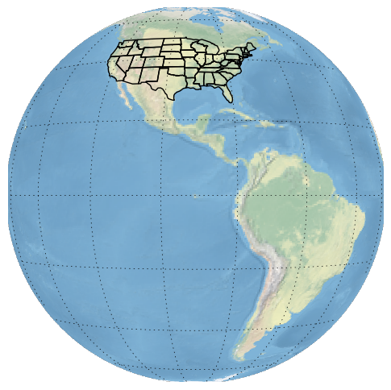

Working with Projections
------------------------

`**Projections** <https://en.wikipedia.org/wiki/Map_projection>`__ are
the ``geoplot`` killer feature.

Allow me to explain. The simplest starting point is ``polyplot``. This
rudimentary plot type which simply takes the geometry in the data and
plops it down on a map: nothing more.

.. code:: python

    import sys; sys.path.insert(0, '../../')  # ignore this
    import geopandas as gpd
    import geoplot as gplt
    %matplotlib inline

.. code:: python

    usa = gpd.read_file("../../data/united_states/usa.geojson")
    usa = usa[~usa['adm1_code'].isin(['USA-3517', 'USA-3563'])]

.. code:: python

    gplt.polyplot(usa)

.. parsed-literal::

    <cartopy.mpl.geoaxes.GeoAxesSubplot at 0x104890898>

This is an example of an **unprojected plot**. It faithfully reproduces
exact latitude and longitudes as Cartesian coordinates on a plane.

But remember, the Earth is not a flat surface; it's a sphere. This isn't
a map of the United States that you'd seen in print anywhere because it
badly distorts both of the `two
criteria <http://www.geo.hunter.cuny.edu/~jochen/gtech201/lectures/lec6concepts/Map%20coordinate%20systems/How%20to%20choose%20a%20projection.htm>`__
most projections are evaluated on: *shape* and *area*.

Nevertheless, unprojected plots have their uses. Firstly, for small
features, unprojected plots are usually OK. Second of all, there is the
fact that when not provided a projection ``geoplot`` tries to output a
pure ``matplotlib`` figure, which means that this tool can be easily
incorporated with other ``matplotlib`` figures or with other tools, like
``mplleaflet``, which expect ``matplotlib`` input.

But if we're not trying to achieve either of these things, it's better
to pick a good projection and use that instead.

In the case of the contiguous United States, the coordinate reference
system most often used is known as the Albers Equal Area projection. To
place our plot in a projection, we need to pass the projection of
interest to the ``projection`` keyword parameter. ``geoplot`` functions
expect input to come from the ``geoplot.crs`` module, imported as
``ccrs`` by convention.

.. code:: python

    import geoplot.crs as ccrs
    gplt.polyplot(usa, projection=ccrs.AlbersEqualArea())

.. parsed-literal::

    <cartopy.mpl.geoaxes.GeoAxesSubplot at 0x113ad2748>

``geoplot`` projections are a very thin wrapper on ``cartopy.crs``
projections, and every ``cartopy`` projection is implemented in
``geoplot.crs``. As such, for a list of implemented projections `refer
to the Cartopy
documentation <http://scitools.org.uk/cartopy/docs/latest/crs/projections.html>`__.

You may be wondering, if ``geoplot.crs`` is a wrapper on
``cartopy.crs``, why not just use Cartopy CRS objects directly? This
comes down to an important implementation detail: when Cartopy CRS
objects are used as the library intends for them to be used, projection
geolocation settings are supposed to be defined as parameters to the
projection and cannot be modified after instantiation. This means that
if you don't explicitly specify otherwise yourself, a Cartopy CRS object
will result in a map centered on mid-Africa—coordinate ``(0, 0)``!

``geoplot`` avoids forcing this extra work on the user by computing
sensible defaults, based on the data provided, when exact settings are
not provided. This is why the plot above "just works": ``geoplot``
computed the mean centroid of the polygons and centered the plot on that
coordinate in the background. This feature comes at the cost of a little
bit of awkwardness, requiring our wrapper classes, but overall the
tradeoff seems to be very "worth it".

The defaults aren't perfect, however. If you look closely at this figure
you'll notice that our copy of the United States is ever so slightly
skewed downwards and to the right, indicating that our settings are a
teeny bit wrong. We can correct this by specifying the centering
coordinates ourselves.

The `center of the contiguous United
States <https://en.wikipedia.org/wiki/Geographic_center_of_the_contiguous_United_States>`__
is 39°50′N 98°35′W. If we provide approximately these coordinates as
``central_latitude`` and ``central_longitude`` coordinates to our
projection, our skew is fixed!

(Editor's Note: Fitting projections boundaries is still a WIP, hence the
weirdness.)

.. code:: python

    gplt.polyplot(usa, projection=ccrs.AlbersEqualArea(central_longitude=-98, central_latitude=39.5))

.. parsed-literal::

    <cartopy.mpl.geoaxes.GeoAxesSubplot at 0x113c652b0>

This is the version of the map of the United States that you're probably
most familiar with.

Of course, why stop there? I encourage you to experiment with some of
the crazier projections (like ``Gnomonic``) that ``cartopy`` provides.
Of particular value are global projections, which provide a way of
visualizing your data on top of an actual for-real sphere—neat! A
demonstrative exame is provided below.

.. code:: python

    ax = gplt.polyplot(usa, projection=ccrs.Geostationary())
    ax.set_global()
    ax.gridlines()
    ax.stock_img()

.. parsed-literal::

    <matplotlib.image.AxesImage at 0x1157d8828>

`Click here to continue to the next section of the tutorial:
"Plotting" <./plotting.html>`__.
