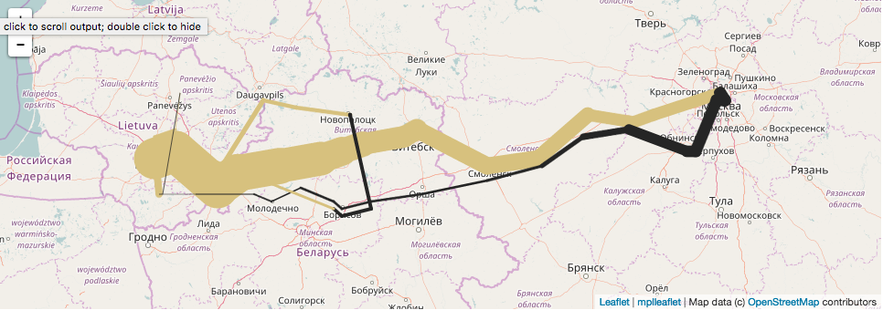

.. _nyc-motor-vehicle-collisions:

Sankey webmap
=============

.. comment:: .. raw:: html

    <iframe src="./minard-napoleon-russia-figure.html"
    marginwidth="0" marginheight="0" scrolling="no" style="width:960px; height:600px; border:0; overflow:hidden;">
    </iframe>

This example is a ``geoplot`` implementation of `Minard's famous visualization on Napoleon's lethal march to Moscow and
back <https://en.wikipedia.org/wiki/Charles_Joseph_Minard#Work>`_. Compare with the original:

.. image::  minard-napoleon-original.gif

**Python source code:** :download:`[download source: minard-napoloen-russia.py]<minard-napoloen-russia.py>`

.. literalinclude:: minard-napoloen-russia.py
    :lines: 2-