==============
Plot Reference
==============

Pointplot
---------

The ``pointplot`` is a `geospatial scatter plot 
<https://en.wikipedia.org/wiki/Scatter_plot>`_ that represents each observation in your dataset
as a single point on a map. It is simple and easily interpretable plot that is universally
understood, making it an ideal choice for showing simple pointwise relationships between
observations.

``pointplot`` requires, at a minimum, some points for plotting:

.. code-block:: python

    import geoplot as gplt
    import geoplot.crs as gcrs
    import geopandas as gpd
    cities = gpd.read_file(gplt.datasets.get_path('usa_cities'))
    gplt.pointplot(cities)

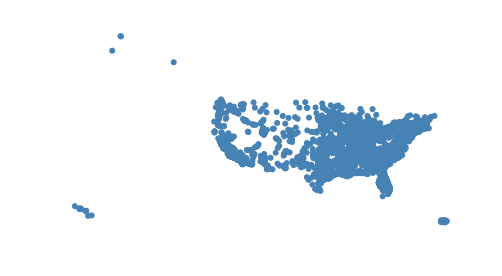

The ``hue`` parameter accepts applies a colormap to a data column. The ``legend`` parameter
toggles a legend.

.. code-block:: python

    gplt.pointplot(cities, projection=gcrs.AlbersEqualArea(), hue='ELEV_IN_FT', legend=True)

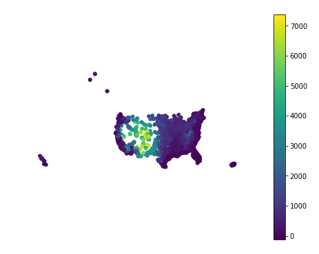

Keyword arguments that are not part of the ``geoplot`` API are passed to the underlying
`matplotlib.pyplot.scatter instance 
<https://matplotlib.org/3.1.0/api/_as_gen/matplotlib.pyplot.scatter.html>`_,
which can be used to customize the appearance of the
plot. To pass keyword argument to the legend, use the ``legend_kwargs`` argument.

.. code-block:: python

    gplt.pointplot(
        cities, projection=gcrs.AlbersEqualArea(), 
        hue='ELEV_IN_FT',
        legend=True, legend_kwargs={'loc': 'upper left'},
        edgecolor='lightgray', linewidth=0.5
    )

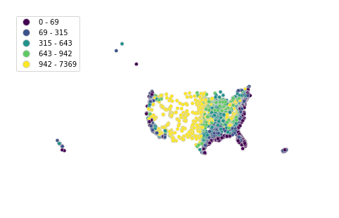

Change the colormap using ``cmap``, or the number of color bins using ``k``. To use a
continuous colormap, set ``k=None``.

.. code-block:: python

    gplt.pointplot(
        cities, projection=gcrs.AlbersEqualArea(),
        hue='ELEV_IN_FT', k=8, cmap='inferno_r',
        legend=True
    )

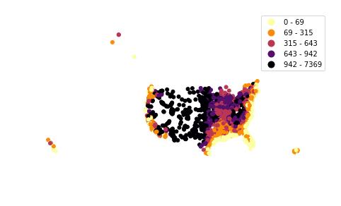

``scale`` provides an alternative or additional visual variable. The minimum and maximum size
of the points can be adjusted to fit your data using the ``limits`` parameter. It is often
benefitial to combine both ``scale`` and ``hue`` in a single plot. In this case, you can use
the ``legend_var`` variable to control which visual variable the legend is keyed on.

.. code-block:: python

    gplt.pointplot(
        cities, projection=gcrs.AlbersEqualArea(), 
        hue='ELEV_IN_FT', scale='ELEV_IN_FT', limits=(0.1, 3), cmap='inferno_r',
        legend=True, legend_var='scale'
    )

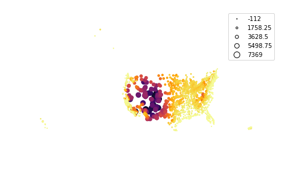

Polyplot
--------

The polyplot draws polygons on a map.

.. code-block:: python

    import geoplot as gplt
    import geoplot.crs as gcrs
    import geopandas as gpd
    boroughs = gpd.read_file(gplt.datasets.get_path('nyc_boroughs'))
    gplt.polyplot(boroughs, projection=gcrs.AlbersEqualArea())

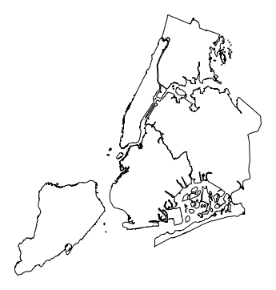

``polyplot`` is intended to act as a basemap for other, more interesting plot types.

.. code-block:: python

    ax = gplt.polyplot(boroughs, projection=gcrs.AlbersEqualArea())
    gplt.pointplot(
        collisions[collisions['BOROUGH'].notnull()], hue='BOROUGH', ax=ax, legend=True
    )

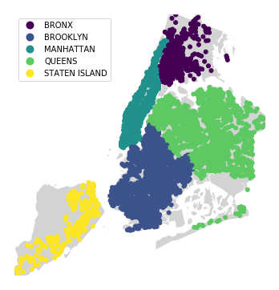

Choropleth
----------

A choropleth takes observations that have been aggregated on some meaningful polygonal level
(e.g. census tract, state, country, or continent) and displays the data to the reader using
color. It is a well-known plot type, and likeliest the most general-purpose and well-known of
the specifically spatial plot types.

A basic choropleth requires polygonal geometries and a ``hue`` variable.

.. code-block:: python

    import geoplot as gplt
    import geoplot.crs as gcrs
    import geopandas as gpd
    boroughs = gpd.read_file(gplt.datasets.get_path('nyc_boroughs'))
    gplt.choropleth(boroughs, hue='Shape_Area')

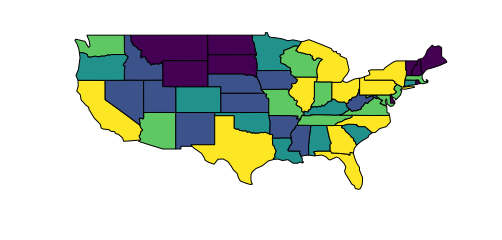

Change the colormap using ``cmap``, or the number of color bins using ``k``. To use a
continuous colormap, set ``k=None``. The ``legend`` parameter toggles the legend.

.. code-block:: python

    gplt.choropleth(
        contiguous_usa, hue='population', projection=gcrs.AlbersEqualArea(),
        cmap='Greens', k=None, legend=True
    )

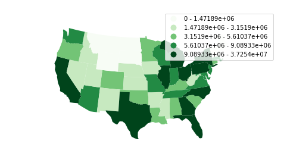

Keyword arguments that are not part of the ``geoplot`` API are passed to the underlying
``matplotlib.patches.Polygon`` objects; this can be used to control plot aesthetics. To pass
keyword argument to the ``matplotlib.legend.Legend``, use the ``legend_kwargs`` argument.

.. code-block:: python

    gplt.choropleth(
        contiguous_usa, hue='population', projection=gcrs.AlbersEqualArea(),
        edgecolor='white', linewidth=1,
        cmap='Greens', legend=True, legend_kwargs={'loc': 'lower left'}
    )

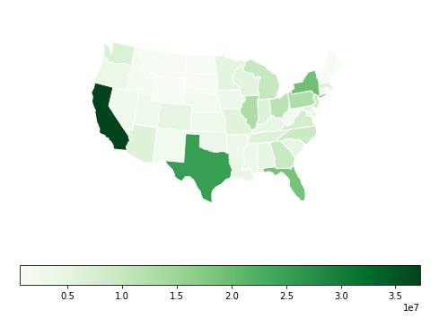

Plots with a categorical colormap can use the ``scheme`` parameter to control how the data gets
sorted into the ``k`` bins. The default ``quantile`` sorts into an equal number of observations
per bin, whereas ``equal_interval`` creates bins equal in size. The more complicated
``fisher_jenks`` scheme is an intermediate between the two.

.. code-block:: python

    gplt.choropleth(
        contiguous_usa, hue='population', projection=gcrs.AlbersEqualArea(),
        edgecolor='white', linewidth=1,
        cmap='Greens', legend=True, legend_kwargs={'loc': 'lower left'},
        scheme='fisher_jenks'
    )

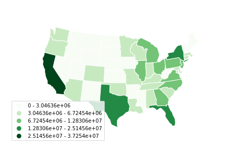

Use ``legend_labels`` and ``legend_values`` to customize the labels and values that appear
in the legend.

.. code-block:: python

    gplt.choropleth(
        contiguous_usa, hue='population', projection=gcrs.AlbersEqualArea(),
        edgecolor='white', linewidth=1,
        cmap='Greens', legend=True, legend_kwargs={'loc': 'lower left'},
        scheme='fisher_jenks',
        legend_labels=[
            '<3 million', '3-6.7 million', '6.7-12.8 million',
            '12.8-25 million', '25-37 million'
        ]
    )

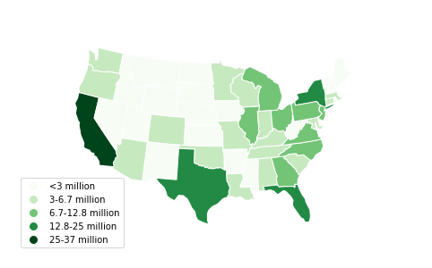

KDEPlot
-------

`Kernel density estimation <https://en.wikipedia.org/wiki/Kernel_density_estimation>`_ is a
technique that non-parameterically estimates a distribution function for a sample of point
observations. KDEs are a popular tool for analyzing data distributions; this plot applies this
technique to the geospatial setting.

A basic ``kdeplot`` takes pointwise data as input. For interpretability, let's also plot the
underlying borough geometry.

.. code-block:: python

    import geoplot as gplt
    import geoplot.crs as gcrs
    import geopandas as gpd
    boroughs = gpd.read_file(gplt.datasets.get_path('nyc_boroughs'))
    collisions = gpd.read_file(gplt.datasets.get_path('nyc_collision_factors'))
    ax = gplt.polyplot(boroughs, projection=gcrs.AlbersEqualArea())
    gplt.kdeplot(collisions, ax=ax)

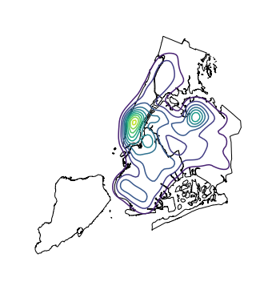

``n_levels`` controls the number of isochrones. ``cmap`` control the colormap.

.. code-block:: python

    ax = gplt.polyplot(boroughs, projection=gcrs.AlbersEqualArea())
    gplt.kdeplot(collisions, n_levels=20, cmap='Reds', ax=ax)

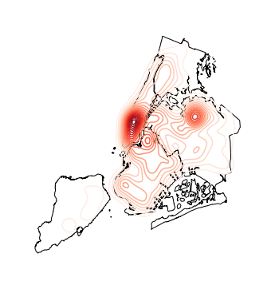

``shade`` toggles shaded isochrones. Use ``clip`` to constrain the plot to the surrounding
geometry.

.. code-block:: python

    ax = gplt.polyplot(boroughs, ax=ax, projection=gcrs.AlbersEqualArea())
    gplt.kdeplot(collisions, cmap='Reds', shade=True, clip=boroughs, ax=ax)

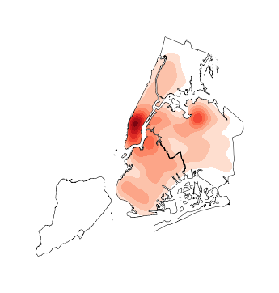

Additional keyword arguments that are not part of the ``geoplot`` API are passed to
`the underlying seaborn.kdeplot instance <http://seaborn.pydata.org/generated/seaborn.kdeplot.html#seaborn.kdeplot>`_.
One of the most useful of these parameters is ``shade_lowest``, which toggles shading on the
lowest (basal) layer of the kernel density estimate.

.. code-block:: python

    ax = gplt.polyplot(boroughs, projection=gcrs.AlbersEqualArea())
    ax = gplt.kdeplot(collisions, cmap='Reds', shade=True, shade_lowest=True, clip=boroughs)

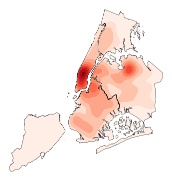

Sankey
------

A `Sankey diagram <https://en.wikipedia.org/wiki/Sankey_diagram>`_ visualizes flow through a
network. It can be used to show the magnitudes of data moving through a system. This plot
brings the Sankey diagram into the geospatial context; useful for analyzing traffic load a road
network, for example, or travel volumes between different airports.

A basic ``sankey`` requires a ``GeoDataFrame`` of ``LineString`` or ``MultiPoint`` geometries.
For interpretability, these examples also include world geometry.

.. code-block:: python

    import geoplot as gplt
    import geoplot.crs as gcrs
    import geopandas as gpd
    la_flights = gpd.read_file(gplt.datasets.get_path('la_flights'))
    world = gpd.read_file(gplt.datasets.get_path('world'))

    ax = gplt.sankey(la_flights, projection=gcrs.Mollweide())
    gplt.polyplot(world, ax=ax, facecolor='lightgray', edgecolor='white')
    ax.set_global(); ax.outline_patch.set_visible(True)

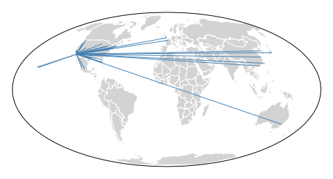

``hue`` adds color gradation to the map. Use ``cmap`` to control the colormap used and ``k``
to control the number of color bins. ``legend`` toggles a legend.

.. code-block:: python

    ax = gplt.sankey(
        la_flights, projection=gcrs.Mollweide(),
        scale='Passengers', hue='Passengers', cmap='Greens', legend=True
    )
    gplt.polyplot(
        world, ax=ax, facecolor='lightgray', edgecolor='white'
    )
    ax.set_global(); ax.outline_patch.set_visible(True)

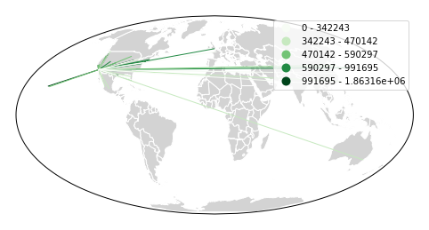

``scale`` adds volumetric scaling to the plot. ``limits`` can be used to control the minimum
and maximum line width.

.. code-block:: python

    ax = gplt.sankey(
        la_flights, projection=gcrs.Mollweide(),
        scale='Passengers', limits=(1, 10),
        hue='Passengers', cmap='Greens', legend=True
    )
    gplt.polyplot(
        world, ax=ax, facecolor='lightgray', edgecolor='white'
    )
    ax.set_global(); ax.outline_patch.set_visible(True)

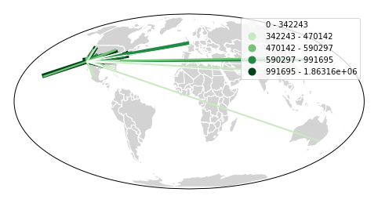

Keyword arguments can be passed to the legend using the ``legend_kwargs`` argument. These
arguments will be passed to the underlying legend.

.. code-block:: python

    ax = gplt.sankey(
        la_flights, projection=gcrs.Mollweide(),
        scale='Passengers', limits=(1, 10),
        hue='Passengers', cmap='Greens',
        legend=True, legend_kwargs={'loc': 'lower left'}
    )
    gplt.polyplot(
        world, ax=ax, facecolor='lightgray', edgecolor='white'
    )
    ax.set_global(); ax.outline_patch.set_visible(True)

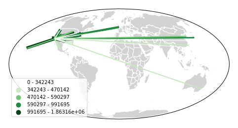

Quadtree
--------

A quadtree is a tree data structure which splits a space into increasingly small rectangular
fractals. This plot takes a sequence of point or polygonal geometries as input and builds a
choropleth out of their centroids, where each region is a fractal quadrangle with at least
``nsig`` observations.

A quadtree demonstrates density quite effectively. It's more flexible than a conventional
choropleth, and given a sufficiently large number of points `can construct a very detailed
view of a space <https://i.imgur.com/n2xlycT.png>`_.

A simple ``quadtree`` specifies a dataset. It's recommended to also set a maximum number of
observations per bin, ``nmax``. The smaller the ``nmax``, the more detailed the plot (the
minimum value is 1).

.. code-block:: python

    import geoplot as gplt
    import geoplot.crs as gcrs
    collisions = gpd.read_file(gplt.datasets.get_path('nyc_collision_factors'))
    gplt.quadtree(collisions, nmax=1)

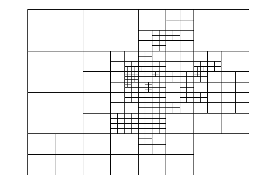

Use ``clip`` to clip the result to surrounding geometry.  Note that if the clip geometry is
complicated, this operation will take a long time; consider simplifying complex geometries with
``simplify`` to speed it up.

Keyword arguments that are not part of the ``geoplot`` API are passed to the
`underlying matplotlib.patches.Patch instances
<https://matplotlib.org/3.1.0/api/_as_gen/matplotlib.patches.Patch.html>`_, which can be used
to customize the appearance of the plot.

.. code-block:: python

    gplt.quadtree(
        collisions, nmax=1,
        projection=gcrs.AlbersEqualArea(), clip=boroughs.simplify(0.001),
        facecolor='lightgray', edgecolor='white'
    )

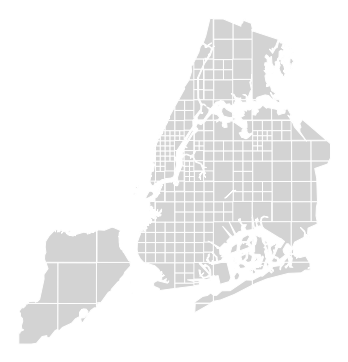

A basic clipped quadtree plot such as this can be used as an alternative to ``polyplot`` as
a basemap.

.. code-block:: python

    ax = gplt.quadtree(
        collisions, nmax=1,
        projection=gcrs.AlbersEqualArea(), clip=boroughs,
        facecolor='lightgray', edgecolor='white', zorder=0
    )
    gplt.pointplot(collisions, s=1, ax=ax)

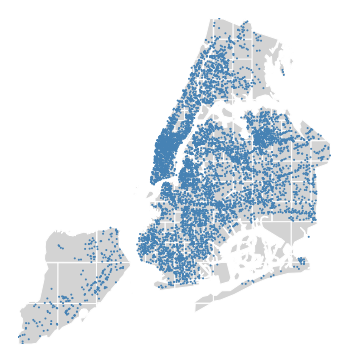

Use ``hue`` to add color as a visual variable to the plot. ``cmap`` controls the colormap
used. ``legend`` toggles the legend. The individual values of the points included in the
partitions are aggregated, and each partition is colormapped based on this aggregate value.

This type of plot is an effective gauge of distribution: the less random the plot output, the
more spatially correlated the variable.

The default aggregation function is ``np.mean``, but you can configure the aggregation
by passing a different function to ``agg``.

.. code-block:: python

    gplt.quadtree(
        collisions, nmax=1,
        projection=gcrs.AlbersEqualArea(), clip=boroughs,
        hue='NUMBER OF PEDESTRIANS INJURED', cmap='Reds',
        edgecolor='white', legend=True
    )

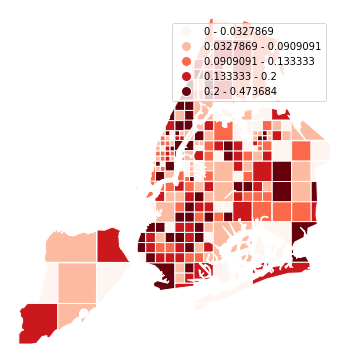

Change the number of bins by specifying an alternative ``k`` value. To use a continuous
colormap, explicitly specify ``k=None``.  You can change the binning sceme with ``scheme``.
The default is ``quantile``, which bins observations into classes of different sizes but the
same numbers of observations. ``equal_interval`` will creates bins that are the same size, but
potentially containing different numbers of observations. The more complicated ``fisher_jenks``
scheme is an intermediate between the two.

.. code-block:: python

    gplt.quadtree(
        collisions, nmax=1,
        projection=gcrs.AlbersEqualArea(), clip=boroughs,
        hue='NUMBER OF PEDESTRIANS INJURED', cmap='Reds', k=None,
        edgecolor='white', legend=True,
    )

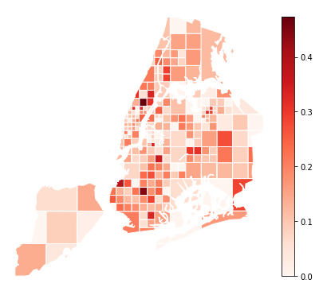

Here is a demo of an alternative aggregation function.

.. code-block:: python

    gplt.quadtree(
        collisions, nmax=1, agg=np.max,
        projection=gcrs.AlbersEqualArea(), clip=boroughs,
        hue='NUMBER OF PEDESTRIANS INJURED', cmap='Reds', k=None
        edgecolor='white', legend=True
    )

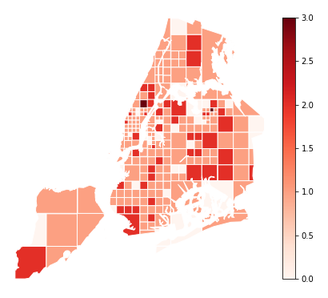

Voronoi
-------

The `Voronoi region <https://en.wikipedia.org/wiki/Voronoi_diagram>`_ of an point is the set
of points which is closer to that point than to any other observation in a dataset. A Voronoi
diagram is a space-filling diagram that constructs all of the Voronoi regions of a dataset and
plots them.

Voronoi plots are efficient for judging point density and, combined with colormap, can be used
to infer regional trends in a set of data.

Due to limitations with ``matplotlib``, ``voronoi`` diagrams in ``geoplot`` are limited in size
to a few thousand polygons.

A basic ``voronoi`` specifies some point data. We overlay geometry to aid interpretability.

.. code-block:: python

    ax = gplt.voronoi(injurious_collisions.head(1000))
    gplt.polyplot(boroughs, ax=ax)

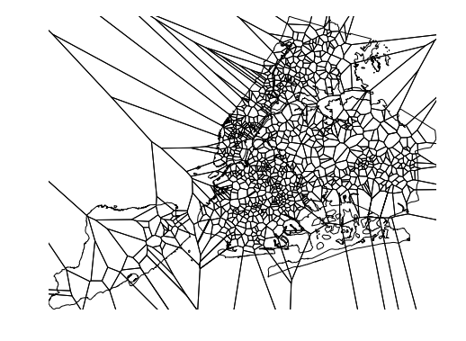

Use ``clip`` to clip the result to surrounding geometry. This is recommended in most cases.
Note that if the clip geometry is complicated, this operation will take a long time; consider
simplifying complex geometries with ``simplify`` to speed it up.

.. code-block:: python

    ax = gplt.voronoi(
        injurious_collisions.head(100),
        clip=boroughs.simplify(0.001), projection=gcrs.AlbersEqualArea()
    )
    gplt.polyplot(boroughs, ax=ax)

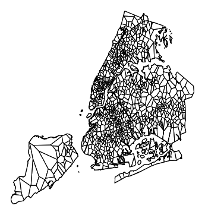

Use ``hue`` to add color as a visual variable to the plot. Change the colormap using ``cmap``,
or the number of color bins using ``k``. To use a continuous colormap, set ``k=None``.
``legend`` toggles the legend.

.. code-block:: python

    ax = gplt.voronoi(
        injurious_collisions.head(1000), projection=gcrs.AlbersEqualArea(),
        clip=boroughs.simplify(0.001),
        hue='NUMBER OF PERSONS INJURED', cmap='Reds',
        legend=True
    )
    gplt.polyplot(boroughs, ax=ax)

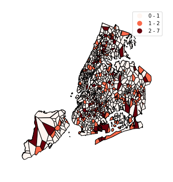

Keyword arguments that are not part of the ``geoplot`` API are passed to the underlying
``matplotlib``
`Polygon patches <http://matplotlib.org/api/patches_api.html#matplotlib.patches.Polygon>`_,
which can be used to customize the appearance of the plot. To pass keyword argument to the
legend, use the ``legend_kwargs`` argument.

.. code-block:: python

    ax = gplt.voronoi(
        injurious_collisions.head(1000), projection=gcrs.AlbersEqualArea(),
        clip=boroughs.simplify(0.001),
        hue='NUMBER OF PERSONS INJURED', cmap='Reds',
        legend=True,
        edgecolor='white', legend_kwargs={'loc': 'upper left'}
    )
    gplt.polyplot(boroughs, edgecolor='black', zorder=1, ax=ax)

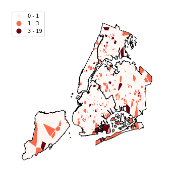

To use a continuous colormap, explicitly specify ``k=None``.  You can change the binning sceme
with ``scheme``. The default is ``quantile``, which bins observations into classes of different
sizes but the same numbers of observations. ``equal_interval`` will creates bins that are the
same size, but potentially containing different numbers of observations. The more complicated
``fisher_jenks`` scheme is an intermediate between the two.

.. code-block:: python

    ax = gplt.voronoi(
        injurious_collisions.head(1000), projection=gcrs.AlbersEqualArea(),
        clip=boroughs.simplify(0.001),
        hue='NUMBER OF PERSONS INJURED', cmap='Reds', k=None,
        legend=True,
        edgecolor='white'
    )
    gplt.polyplot(boroughs, edgecolor='black', zorder=1, ax=ax)

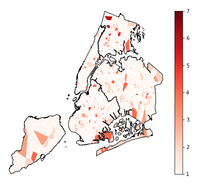