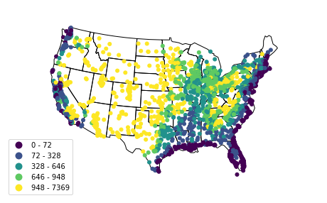

Quickstart
==========

``geoplot`` is a geospatial data visualization library designed for data
scientists and geospatial analysts that just want to get things done. In
this tutorial we will learn the basics of ``geoplot`` and see how it is
used.

I recommend reading this notebook using
`NBViewer <https://nbviewer.jupyter.org/github/ResidentMario/geoplot/blob/master/notebooks/tutorials/Quickstart.ipynb>`__
or, better yet, following along interactively using
`Binder <https://mybinder.org/v2/gh/ResidentMario/geoplot/master?filepath=notebooks/tutorials/Quickstart.ipynb>`__.

.. code:: ipython3

    # Configure matplotlib.
    %matplotlib inline
    
    # Unclutter the display.
    import pandas as pd; pd.set_option('max_columns', 6)

Working with geospatial data
----------------------------

The starting point for geospatial analysis is geospatial data. The
standard way of dealing with such data in Python using ``geopandas``—a
geospatial data parsing library over the well-known ``pandas`` library.

.. code:: ipython3

    import geopandas as gpd

``geoplot`` represents data using a ``GeoDataFrame``, which is just a
``pandas`` ``DataFrame`` with a special ``geometry`` column containing a
geometric object describing the physical nature of the record in
question: a ``POINT`` in space, a ``POLYGON`` in the shape of New York,
and so on.

.. code:: ipython3

    import geoplot as gplt
    usa_cities = gpd.read_file(gplt.datasets.get_path('usa_cities'))
    usa_cities.head()

.. raw:: html

    

    
    <table border="1" class="dataframe">
      <thead>
        <tr style="text-align: right;">
          <th></th>
          <th>id</th>
          <th>POP_2010</th>
          <th>ELEV_IN_FT</th>
          <th>STATE</th>
          <th>geometry</th>
        </tr>
      </thead>
      <tbody>
        <tr>
          <th>0</th>
          <td>53</td>
          <td>40888.0</td>
          <td>1611.0</td>
          <td>ND</td>
          <td>POINT (-101.2962732 48.23250950000011)</td>
        </tr>
        <tr>
          <th>1</th>
          <td>101</td>
          <td>52838.0</td>
          <td>830.0</td>
          <td>ND</td>
          <td>POINT (-97.03285469999997 47.92525680000006)</td>
        </tr>
        <tr>
          <th>2</th>
          <td>153</td>
          <td>15427.0</td>
          <td>1407.0</td>
          <td>ND</td>
          <td>POINT (-98.70843569999994 46.91054380000003)</td>
        </tr>
        <tr>
          <th>3</th>
          <td>177</td>
          <td>105549.0</td>
          <td>902.0</td>
          <td>ND</td>
          <td>POINT (-96.78980339999998 46.87718630000012)</td>
        </tr>
        <tr>
          <th>4</th>
          <td>192</td>
          <td>17787.0</td>
          <td>2411.0</td>
          <td>ND</td>
          <td>POINT (-102.7896241999999 46.87917560000005)</td>
        </tr>
      </tbody>
    </table>
    

It’s important to note that ``shapely``, the library ``geopandas`` uses
to store its geometries, uses “modern” longitude-latitude ``(x, y)``
coordinate order. This differs from the “historical” latitude-longitude
``(y, x)`` coordinate order. Datasets “in the wild” may be in either
format, so after reading in some data make sure to verify that your
coordinates are in the right order!

This is the bare minimum you need to know about geospatial data to work
with ``geoplot``.

To learn more about geospatial data in Python refer to the section of
the tutorial on `Working with Geospatial
Data <https://nbviewer.jupyter.org/github/ResidentMario/geoplot/blob/master/notebooks/tutorials/Working%20with%20Geospatial%20Data.ipynb>`__.

Basic usage
-----------

If you have ever worked with ``geopandas`` before you are probably
familiar with ``plot``, which can be used to quickly and easily plot the
data in a ``GeoDataFrame``:

.. code:: ipython3

    continental_usa_cities = usa_cities.query('STATE not in ["HI", "AK", "PR"]')
    continental_usa_cities.plot()

.. parsed-literal::

    <matplotlib.axes._subplots.AxesSubplot at 0x11e44ebe0>

We can replicate this result with nicer defaults using the ``pointplot``
function in ``geoplot``:

.. code:: ipython3

    import geoplot as gplt
    gplt.pointplot(continental_usa_cities)

.. parsed-literal::

    <matplotlib.axes._subplots.AxesSubplot at 0x11275f710>

.. image:: Quickstart_files/Quickstart_10_1.png

If you have polygonal data instead, you can plot that using a
``geoplot`` ``polyplot``.

.. code:: ipython3

    contiguous_usa = gpd.read_file(gplt.datasets.get_path('contiguous_usa'))

.. code:: ipython3

    gplt.polyplot(contiguous_usa)

.. parsed-literal::

    <matplotlib.axes._subplots.AxesSubplot at 0x1215c2240>

.. image:: Quickstart_files/Quickstart_13_1.png

There we go, our first ``geoplot`` plot!

We can combine the these two plots using overplotting. **Overplotting**
is the act of stacking several different plots on top of one another,
useful for providing additional context for our plots:

.. code:: ipython3

    ax = gplt.polyplot(contiguous_usa)
    gplt.pointplot(continental_usa_cities, ax=ax)

.. parsed-literal::

    <matplotlib.axes._subplots.AxesSubplot at 0x11e5d8898>

.. image:: Quickstart_files/Quickstart_15_1.png

You might notice that this map of the United States looks very strange.
The Earth, being a sphere, is impossible to potray in two dimensionals.
Hence, whenever we take data off the sphere and place it onto a map, we
are using some kind of **projection**, or method of flattening the
sphere. Plotting data without a projection, or “carte blanche”, creates
distortion in your map. We can “fix” the distortion by picking a better
projection.

The Albers equal area projection is one most common in the United
States. Here’s how you use it with ``geoplot``:

.. code:: ipython3

    import geoplot.crs as gcrs
    
    proj = gcrs.AlbersEqualArea()
    ax = gplt.polyplot(contiguous_usa, projection=proj)
    gplt.pointplot(continental_usa_cities, ax=ax, projection=proj)

.. parsed-literal::

    <cartopy.mpl.geoaxes.GeoAxesSubplot at 0x123b32a58>

.. image:: Quickstart_files/Quickstart_17_1.png

This looks much better than our first plot! In fact, this is the version
of the United States that you’ll probably most often see in maps; and
it’s just one of dozens of projections provided in ``geoplot``.

To learn more about projections check out the section of the tutorial on
`Working with
Projection <https://nbviewer.jupyter.org/github/ResidentMario/geoplot/blob/master/notebooks/tutorials/Working%20with%20Projections.ipynb>`__.

What if you want to make your plot prettier? ``geoplot`` is based on the
venerable ``matplotlib`` (via ``cartopy``), and thus has tons of options
for customizing your plots:

.. code:: ipython3

    import matplotlib.pyplot as plt
    
    proj = gcrs.AlbersEqualArea()
    
    ax = gplt.polyplot(
        contiguous_usa, 
        zorder=-1,  # place the state shapes below the cities.
        linewidth=1,
        projection=proj,
        edgecolor='white',
        facecolor='lightgray',
        figsize=(12, 12)  # make the figure bigger.
    )
    
    gplt.pointplot(
        continental_usa_cities, 
        scale='POP_2010',  # set point size based on population
        limits=(1, 80),    # scale points from 1x to 80x
        hue='POP_2010',    # Changing the color with population, too...
        cmap='Blues',          # ...more blue, more people...
        k=5,                   # but let's limit ourselves to just five "classes" of city sizes.
        legend=True,           # Show a legend...
        legend_var='scale',    # ...based on circle size...
        legend_values=[8000000, 2000000, 1000000, 100000],
        legend_labels=['8 million', '2 million', '1 million', '100 thousand'],  # ...with these five values...
        legend_kwargs={'frameon': False, 'loc': 'lower right'},  # ...on the lower right.
        ax=ax, 
        projection=proj
    )
    
    plt.title("Cities in the contiguous United States, 2010")  # add a title

.. parsed-literal::

    /Users/alex/miniconda3/envs/geoplot-dev/lib/python3.6/site-packages/scipy/stats/stats.py:1633: FutureWarning: Using a non-tuple sequence for multidimensional indexing is deprecated; use `arr[tuple(seq)]` instead of `arr[seq]`. In the future this will be interpreted as an array index, `arr[np.array(seq)]`, which will result either in an error or a different result.
      return np.add.reduce(sorted[indexer] * weights, axis=axis) / sumval

.. parsed-literal::

    Text(0.5, 1.0, 'Cities in the contiguous United States, 2010')

For a detailed guide to the plot customization options available in
``geoplot``, check out the section of the tutorial on `Customizing
Plots <https://nbviewer.jupyter.org/github/ResidentMario/geoplot/blob/master/notebooks/tutorials/Customizing%20Plots.ipynb>`__.

.. raw:: html

   <!-- TODO: contextily -->

More plotting options
---------------------

``geoplot`` is organized in terms of **plots**. There are seven
different plot types, each of which has strengths, weaknesses, and
expected data types.

We have seen two so far: ``polyplot`` and ``pointplot``.

``polyplot`` is the simplest plot in ``geoplot``. It takes polygonal
data (a ``GeoDataFrame`` with ``POLYGON`` or ``MULTIPOLYGON`` objects in
the ``geometry`` column) as input, and provides a map of those polygons
as output. It is used for adding a **basemap** to your visualiaztion: a
representation of the space which adds context to the data you are
actually trying to display.

``pointplot`` is a geospatial scatter plot. It takes point data (a
``GeoDataFrame`` with ``POINT`` objects in the ``geometry`` column) as
input, and provides a map of those points as output. If your data
consists of a set of points, this plot type is a good fist choice: it’s
easy, obviously, and easily explainable.

In this section we will take a brief tour of the remaining plot types.
For even more examples showcasing these plots in action, check out the
`Gallery <https://residentmario.github.io/geoplot/gallery.html>`__.

.. code:: ipython3

    %matplotlib inline
    import geoplot as gplt
    import geopandas as gpd
    
    # import the data
    ny_census_tracts = gpd.read_file(gplt.datasets.get_path('ny_census'))
    ny_census_tracts = ny_census_tracts.assign(
        percent_white=ny_census_tracts['WHITE'] / ny_census_tracts['POP2000']
    )
    
    # set the projection
    import geoplot.crs as gcrs
    proj = gcrs.AlbersEqualArea()
    
    # plot
    gplt.choropleth(
        ny_census_tracts, 
        hue='percent_white',
        projection=proj,
        cmap='Purples',
        edgecolor='white',
        k=None,  # use a continuous colormap
        legend=True
    )

.. parsed-literal::

    <cartopy.mpl.geoaxes.GeoAxesSubplot at 0x11fda46a0>

The `choropleth <https://en.wikipedia.org/wiki/Choropleth_map>`__ is a
well-known plot type; it’s pretty much the bread and butter of
cartographers. A ``choropleth`` partitions an area into a set of
polygons, then colors those geometries according to some scale and some
data input. Choropleths are a standard-bearer map type for displaying
statistical information about regions of interest.

Our example application is a map of New York built out of `statistical
areas <https://en.wikipedia.org/wiki/New_York_statistical_areas>`__ from
the 2010 US Census (other common partitioning schemes common include
countries, states, census tracts, census blocks, police precincts, city
blocks…). Each area is colormapped to the percentage of residents in the
region who identify ethnically as white. The key observation this map
makes that New York City is far more ethnically diverse than the rest of
New York.

Choropleths are easy to make and easy to interpret—a great first choice
for area aggregation data.

.. code:: ipython3

    %matplotlib inline
    import geoplot as gplt
    import geopandas as gpd
    import pandas as pd
    
    # import the data
    obesity_by_state = pd.read_csv(gplt.datasets.get_path('obesity_by_state'), sep='\t')
    contiguous_usa = gpd.read_file(gplt.datasets.get_path('contiguous_usa'))
    contiguous_usa['Obesity Rate'] = contiguous_usa['State'].map(
        lambda state: obesity_by_state.query("State == @state").iloc[0]['Percent']
    )
    
    # set the projection
    import geoplot.crs as gcrs
    proj = gcrs.AlbersEqualArea(central_longitude=-98, central_latitude=39.5)
    
    # plot
    gplt.cartogram(
        contiguous_usa,
        scale='Obesity Rate',
        hue='Obesity Rate',
        cmap='Reds',
        projection=proj,
        limits=(0.75, 1),
        linewidth=0.5,
        k=5,
        trace_kwargs={'linewidth': 0.5, 'zorder': 100},
        legend=True,
        legend_kwargs={'loc': 'lower right'},
        legend_var='hue',
    )

.. parsed-literal::

    /Users/alex/miniconda3/envs/geoplot-dev/lib/python3.6/site-packages/scipy/stats/stats.py:1633: FutureWarning: Using a non-tuple sequence for multidimensional indexing is deprecated; use `arr[tuple(seq)]` instead of `arr[seq]`. In the future this will be interpreted as an array index, `arr[np.array(seq)]`, which will result either in an error or a different result.
      return np.add.reduce(sorted[indexer] * weights, axis=axis) / sumval

.. parsed-literal::

    <cartopy.mpl.geoaxes.GeoAxesSubplot at 0x12b25d550>

A `cartograms <https://en.wikipedia.org/wiki/Cartogram>`__ are a much
less common but potentially more visually impactful alternative to the
choropleth. In a ``cartogram``, each of the areas in question is scaled
according to its value. For example, in this map we have plotted the
states of the United States according to their obesity rates. Using both
color and scale information, we can quickly pick out the healthiest
(Colorado) and unhealthiest (Missisipi, Arkasas, West Virginia) states.

These plot types are both polygonal. What if we want to reason spatially
about point data?

.. code:: ipython3

    import geoplot as gplt
    import geopandas as gpd
    
    # import the data
    nyc_collision_factors = gpd.read_file(gplt.datasets.get_path('nyc_collision_factors'))
    nyc_boroughs = gpd.read_file(gplt.datasets.get_path('nyc_boroughs'))
    
    # set the projection
    import geoplot.crs as gcrs
    proj = gcrs.AlbersEqualArea()
    
    # plot
    ax = gplt.kdeplot(
        nyc_collision_factors,
        projection=proj, 
        shade=True,  # Shade the areas or draw relief lines?
        shade_lowest=False,  # Don't shade near-zeros.
        clip=nyc_boroughs.geometry,  # Constrain the heatmap to this area.
    )
    gplt.polyplot(nyc_boroughs, projection=proj, ax=ax)

.. parsed-literal::

    /Users/alex/miniconda3/envs/geoplot-dev/lib/python3.6/site-packages/scipy/stats/stats.py:1633: FutureWarning: Using a non-tuple sequence for multidimensional indexing is deprecated; use `arr[tuple(seq)]` instead of `arr[seq]`. In the future this will be interpreted as an array index, `arr[np.array(seq)]`, which will result either in an error or a different result.
      return np.add.reduce(sorted[indexer] * weights, axis=axis) / sumval

.. parsed-literal::

    <cartopy.mpl.geoaxes.GeoAxesSubplot at 0x10c7dc940>

A ``kdeplot`` constructs a heatmap for an area by applying a `kernel
density
estimate <https://en.wikipedia.org/wiki/Kernel_density_estimation>`__
function across the points in a dataset.

The ``kdeplot`` is a great tool for examining the distribution of groups
of points. For example, this plot of collisions in New York City makes
it clear where the accident hotspots in the city are located: Midtown
Manhattan and, to a lesser extent, Downtown Brooklyn and LaGuardia.

You can tweak the ``kdeplot`` output to tune how many levels are plotted
(more detailed plots require more data). If you have too *many* points
(order of hundreds of thousands), the plot may take too long to
generate; in this case you should downsample using e.g.
``sample(5000)``.

.. code:: ipython3

    %matplotlib inline
    import geoplot as gplt
    import geopandas as gpd
    
    # import the data
    nyc_injurious_collisions = gpd.read_file(gplt.datasets.get_path('nyc_injurious_collisions'))
    nyc_boroughs = gpd.read_file(gplt.datasets.get_path('nyc_boroughs'))
    
    # set the projection
    import geoplot.crs as gcrs
    proj = gcrs.AlbersEqualArea()
    
    # plot
    ax = gplt.voronoi(
        nyc_injurious_collisions.head(2000),
        hue='NUMBER OF PERSONS INJURED', cmap='Reds',
        edgecolor='white', clip=nyc_boroughs.geometry,
        linewidth=0.5,
        projection=proj,
    )
    gplt.polyplot(nyc_boroughs, linewidth=1, projection=proj, ax=ax)

.. parsed-literal::

    /Users/alex/miniconda3/envs/geoplot-dev/lib/python3.6/site-packages/scipy/stats/stats.py:1633: FutureWarning: Using a non-tuple sequence for multidimensional indexing is deprecated; use `arr[tuple(seq)]` instead of `arr[seq]`. In the future this will be interpreted as an array index, `arr[np.array(seq)]`, which will result either in an error or a different result.
      return np.add.reduce(sorted[indexer] * weights, axis=axis) / sumval

.. parsed-literal::

    <cartopy.mpl.geoaxes.GeoAxesSubplot at 0x125e3e208>

.. image:: Quickstart_files/Quickstart_28_2.png

A ``voronoi`` plot is an alternative method of partitioning a space
using point data. The ``voronoi`` plot uses `voronoi
tesselation <https://en.wikipedia.org/wiki/Voronoi_diagram>`__ to
construct neighborhoods around each point in the dataset. Each
neighborhood consists of all points closest to a particular observation.
Apply a colormap to the result and you get a choropleth of
neighborhoods.

A ``voronoi`` plot is basically a ``choropleth``, except that instead of
defining areas ourselves we build them algorithmically.

**Note** ``voronoi`` is still experimental.

.. code:: ipython3

    %matplotlib inline
    import geoplot as gplt
    import geopandas as gpd
    
    # import the data
    dc_roads = gpd.read_file(gplt.datasets.get_path('dc_roads'))
    
    # set the projection
    import geoplot.crs as gcrs
    proj = gcrs.AlbersEqualArea()
    
    # plot the data
    gplt.sankey(
        dc_roads,
        path=dc_roads.geometry,
        projection=proj,
        scale='aadt',
        limits=(0.1, 10)
    )

.. parsed-literal::

    <cartopy.mpl.geoaxes.GeoAxesSubplot at 0x127da9518>

So far we’ve worked with point data and polygonal data. A third feature
type of import is linear or network data. Examples of linear data
include raffic movements between cities, or the flow of immigrantion
between different countries. For this type of data you can use the
``sankey`` plot, which builds a `Sankey
diagram <https://en.wikipedia.org/wiki/Sankey_diagram>`__ out of your
data.

In this example we can see the road network for Washington DC, taken
from Department of Transit data. Road segments with more traffic on them
are thicker than those with less (you can also use color as your visual
variable instead of width, if you so prefer; or even use both). This
plot makes it easy to see where the major arterial roads in Washington
DC are.

Sankey plots are a flexible way of representing linear feature data.
They work great when you have linear features with relatively little
overlap, but they struggle with datasets with overlapping or
near-overlapping features, which are easily occluded by one another.

What to do next
---------------

You should now know enough ``geoplot`` to be able to start to use it in
your own projects.

You can install ``geoplot`` using ``conda install geoplot``, or
alternative using ``pip install geoplot`` (but see notes in
`Installation <../Installation.html>`__).

To keep learning about ``geoplot`` (and geospatial data in Python in
general) check out the `User
Guides <https://residentmario.github.io/geoplot/guides.html>`__.

Finally, the `API Reference <../api.html>`__ is the definitive guide all
of to the options available for the plot types in ``geoplot``.
