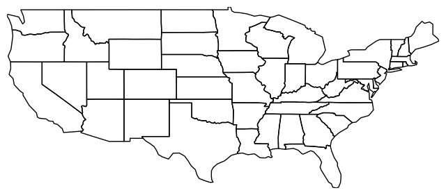
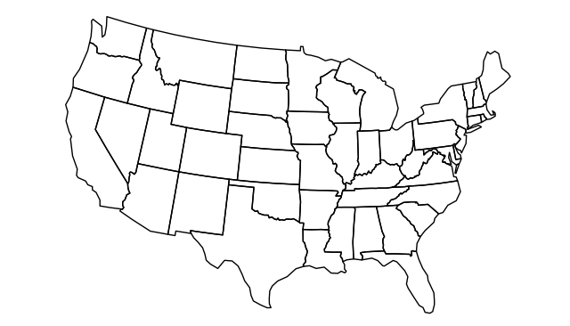
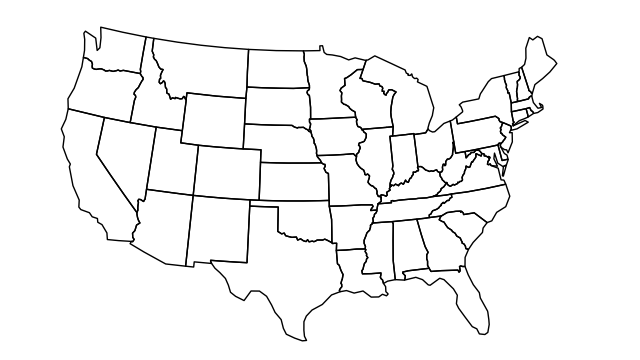

Geoplot tutorial
================

Introduction
------------

``geoplot`` is a tool which fills a gap which I have perceived, in my
own work, as a serious shortcoming in the geospatial Python ecosystem:
the need for a high-level geospatial plotting library.

Geospatial data is any form of data which has a location to it. Most of
the data generated today has such a geospatial context, context which
is, in turn, oftentimes important to understanding the data itself.
Thanks to its ease-of-use and deep ecosystem, the Python programming
language has emerged as a leading choice in the performance of data
analytics, geospatial data analytics included.

Though there are increasingly many options, the venerable ``matplotlib``
remains the core Python plotting tool. Nevertheless, we oftentimes don't
interact with ``matplotlib`` directly; we instead use extensions built
over it, like the ``pandas`` plotting facilities or ``seaborn``, to get
our work done. Knowing how ``matplotlib`` operates is certainly helpful,
but it's neither necessary to get started nor, usually, the fastest way
to get something done.

``geoplot`` aims to be ``seaborn`` for geospatial data. Hence it comes
with the following built-in features:

-  **High-level plotting API**: ``geoplot`` is cartographic plotting for
   the 90% of use cases. All of the standard-bearer maps that you've
   probably seen in your geography textbook are easily accessible, as
   are many more novel options.
-  **Native projection support**: The most fundamental peculiarity of
   geospatial plotting is projection: how do you unroll a sphere onto a
   flat surface (a map) in an accurate way? The answer depends on what
   you're trying to depict. ``geoplot`` provides these options.
-  **Compatibility with matplotlib**: While ``matplotlib`` is not a good
   fit for working with geospatial data directly, it's a format that's
   well-incorporated by other geospatial tools (``mplleaflet`` in
   particular). For compatibility, ``geoplot`` provides an option for
   emiting pure ``matplotlib`` plots.
-  **Built with modern geospatial Python in mind**: Geospatial data is a
   fast-moving target in the Python ecosystem. Innovations in recent
   years have made working with such data much easier than it was when
   e.g. matplotlib's lower-level ``basemap`` tool was being developed,
   which ``geoplot`` leverages with an easy-to-use and widely compatible
   API.

``geoplot`` does this by leveraging two pre-existing libraries in
particular: ``geopandas``, an extension to the mainstay ``pandas``
library with embedded geospatial data support, used for input; and
``cartopy``, a (``matplotlib``-based) low-level plotting library, used
for output.

The rest of this text is a tutorial on ``geoplot`` usage. It is written
for the perspective of someone who has some existing familiarity with
the existing data science ecosystem, but hasn't used the geospatial
tools just yet. If you haven't worked with data before in Python and are
thus unfamiliar with ``pandas``, you should refer to its documentation
first - `10 Minutes to
Pandas <http://pandas.pydata.org/pandas-docs/stable/10min.html>`__ is
one place where you can get started.

Working with geospatial data
----------------------------

In order to understand how to use ``geoplot``, we need to understand a
bit about the format it expects to recieves its data in: a ``geopandas``
``GeoDataFrame``.

The ``GeoDataFrame`` is an augmented version of a ``pandas``
``DataFrame`` with an attached geometry:

.. code:: python

    import geopandas as gpd
    boroughs = gpd.read_file("../data/nyc_boroughs/boroughs.geojson", driver='GeoJSON')
    boroughs


.. raw:: html

    <div>
    <table border="1" class="dataframe">
      <thead>
        <tr style="text-align: right;">
          <th></th>
          <th>BoroCode</th>
          <th>BoroName</th>
          <th>Shape_Area</th>
          <th>Shape_Leng</th>
          <th>geometry</th>
        </tr>
      </thead>
      <tbody>
        <tr>
          <th>0</th>
          <td>5</td>
          <td>Staten Island</td>
          <td>1.623853e+09</td>
          <td>330385.03697</td>
          <td>(POLYGON ((-74.05050806403247 40.5664220341608...</td>
        </tr>
        <tr>
          <th>1</th>
          <td>4</td>
          <td>Queens</td>
          <td>3.049947e+09</td>
          <td>861038.47930</td>
          <td>(POLYGON ((-73.83668274106708 40.5949466970158...</td>
        </tr>
        <tr>
          <th>2</th>
          <td>3</td>
          <td>Brooklyn</td>
          <td>1.959432e+09</td>
          <td>726568.94634</td>
          <td>(POLYGON ((-73.8670614947212 40.58208797679338...</td>
        </tr>
        <tr>
          <th>3</th>
          <td>1</td>
          <td>Manhattan</td>
          <td>6.364422e+08</td>
          <td>358532.95642</td>
          <td>(POLYGON ((-74.01092841268033 40.6844914725429...</td>
        </tr>
        <tr>
          <th>4</th>
          <td>2</td>
          <td>Bronx</td>
          <td>1.186804e+09</td>
          <td>464517.89055</td>
          <td>(POLYGON ((-73.89680883223775 40.7958084451597...</td>
        </tr>
      </tbody>
    </table>
    </div>


Any operation that will work on a ``DataFrame`` will work on a
``GeoDataFrame``, but the latter adds a few additional methods and
features for dealing with geometry not present in the former. The most
obvious of these is the addition of a column for storing geometries,
accessible using the ``geometry`` attribute:

.. code:: python

    boroughs.geometry


.. parsed-literal::

    0    (POLYGON ((-74.05050806403247 40.5664220341608...
    1    (POLYGON ((-73.83668274106708 40.5949466970158...
    2    (POLYGON ((-73.8670614947212 40.58208797679338...
    3    (POLYGON ((-74.01092841268033 40.6844914725429...
    4    (POLYGON ((-73.89680883223775 40.7958084451597...
    Name: geometry, dtype: object


That geometry is stored with reference to some kind of `**coordinate
reference
system** <https://en.wikipedia.org/wiki/Spatial_reference_system>`__, or
CRS. You can extract what CRS your polygons are stored in using the
``crs`` attribute:

.. code:: python

    boroughs.crs


.. parsed-literal::

    {'init': 'epsg:4326'}


In this case ``epsg:4326`` is an identifier for what the rest of us more
commonly refer to as "longitude and latitude". EPSG itself is a
standardized system for refering to coordinate reference systems;
`spatialreference.org <http://spatialreference.org/ref/epsg/wgs-84/>`__
is the best place to look these identifiers up.

Coordinate reference systems are, basically, different ways of
mathematically calculating locations. Due to the complexity of the
surface of the earth, different geographically sensitive systems of
measurement are more or less useful for different tasks. For example,
the United States Geolocial Service, which provides extremely
high-accuracy maps of United States localities, maintains individual
coordinate reference systems, refered to as "state plane systems", for
the various states of the union. These are used throughout government,
and look nothing like the latitude and longitude coordinates that we are
generally more used to.

For example, New York City approximately twice per year releases an
updated version of MapPLUTO, a geospatial dataset which provides
building footprint polygons for all buildings in New York City. This is
the dataset which powers some pretty amazing visualizations, like
`Bklynr's Brooklyn building age
map <http://bklynr.com/block-by-block-brooklyns-past-and-present/>`__.

.. code:: python

    manhattan_buildings = gpd.read_file('../data/manhattan_mappluto/MN_Dcp_Mappinglot.shp')
    manhattan_buildings.head()


.. raw:: html

    <div>
    <table border="1" class="dataframe">
      <thead>
        <tr style="text-align: right;">
          <th></th>
          <th>BLOCK</th>
          <th>BORO</th>
          <th>CREATED_BY</th>
          <th>CREATED_DA</th>
          <th>LAST_MODIF</th>
          <th>LAST_MOD_1</th>
          <th>LOT</th>
          <th>Shape_Area</th>
          <th>Shape_Leng</th>
          <th>geometry</th>
        </tr>
      </thead>
      <tbody>
        <tr>
          <th>0</th>
          <td>20009</td>
          <td>1</td>
          <td>None</td>
          <td>1999-11-30</td>
          <td>sj</td>
          <td>2006-11-30</td>
          <td>9999</td>
          <td>10289.237892</td>
          <td>836.495687</td>
          <td>POLYGON ((986519.6798000038 200244.1201999933,...</td>
        </tr>
        <tr>
          <th>1</th>
          <td>20031</td>
          <td>1</td>
          <td>None</td>
          <td>1999-11-30</td>
          <td>sj</td>
          <td>2006-11-30</td>
          <td>9999</td>
          <td>8943.539985</td>
          <td>478.609196</td>
          <td>POLYGON ((992017.6599999964 216103.8700000048,...</td>
        </tr>
        <tr>
          <th>2</th>
          <td>20027</td>
          <td>1</td>
          <td>None</td>
          <td>1999-11-30</td>
          <td>sj</td>
          <td>2006-11-30</td>
          <td>9999</td>
          <td>10156.610383</td>
          <td>486.181920</td>
          <td>POLYGON ((991564.0900000036 215278.3798999935,...</td>
        </tr>
        <tr>
          <th>3</th>
          <td>20012</td>
          <td>1</td>
          <td>None</td>
          <td>1999-11-30</td>
          <td>sj</td>
          <td>2006-11-30</td>
          <td>9999</td>
          <td>7657.969093</td>
          <td>357.345276</td>
          <td>POLYGON ((986364.6000999957 201496.4998999983,...</td>
        </tr>
        <tr>
          <th>4</th>
          <td>20067</td>
          <td>1</td>
          <td>None</td>
          <td>1999-11-30</td>
          <td>sj</td>
          <td>2007-11-30</td>
          <td>9999</td>
          <td>9171.078777</td>
          <td>479.281556</td>
          <td>POLYGON ((995870.7099999934 223069.0699999928,...</td>
        </tr>
      </tbody>
    </table>
    </div>


But, unlike our easy coordinates above, this data is stored in the Long
Island State Plane coordinate reference system:

.. code:: python

    manhattan_buildings.geometry.head()


.. parsed-literal::

    0    POLYGON ((986519.6798000038 200244.1201999933,...
    1    POLYGON ((992017.6599999964 216103.8700000048,...
    2    POLYGON ((991564.0900000036 215278.3798999935,...
    3    POLYGON ((986364.6000999957 201496.4998999983,...
    4    POLYGON ((995870.7099999934 223069.0699999928,...
    Name: geometry, dtype: object


The file we just read in provided embedded information about its
coordinate reference system, which ``geopandas`` stores as a
```proj4`` <https://github.com/OSGeo/proj.4>`__ string:

.. code:: python

    manhattan_buildings.crs


.. parsed-literal::

    {'datum': 'NAD83',
     'lat_0': 40.16666666666666,
     'lat_1': 40.66666666666666,
     'lat_2': 41.03333333333333,
     'lon_0': -74,
     'no_defs': True,
     'proj': 'lcc',
     'units': 'us-ft',
     'x_0': 300000,
     'y_0': 0}


``geoplot`` expects its input to be in terms of latitude and longitude.
This is required because it's so easy to do: to convert your data from
one CRS to another, you can just use the ``geopandas`` ``to_crs``
method:

.. code:: python

    manhattan_buildings = manhattan_buildings.to_crs(epsg=4326)

Now all of our building footprints are in ordinary coordinates!

.. code:: python

    manhattan_buildings.geometry.head()


.. parsed-literal::

    0    POLYGON ((-73.99181250685882 40.71630025841903...
    1    POLYGON ((-73.97196114404649 40.75982822136702...
    2    POLYGON ((-73.97359928976277 40.75756284914222...
    3    POLYGON ((-73.99237153770106 40.71973777834428...
    4    POLYGON ((-73.95804078098135 40.77894165663843...
    Name: geometry, dtype: object


You should also know, at a minimum, that all of these geometries are
always ```shapely`` <http://toblerity.org/shapely/manual.html>`__
objects:

.. code:: python

    type(manhattan_buildings.geometry.iloc[0])


.. parsed-literal::

    shapely.geometry.polygon.Polygon


.. code:: python

    type(boroughs.geometry.iloc[0])


.. parsed-literal::

    shapely.geometry.multipolygon.MultiPolygon


``shapely`` provides a large API surface for any geometric
transformation or operations that you can think of, and ``geopandas``
wraps many of these even further, creating a convenient way of getting
"classical" GIS operations done on your data. Like ``geopandas``,
``shapely`` is very well-documented, so to dive into these further `read
the documentation <http://toblerity.org/shapely/manual.html>`__.

In this tutorial, we'll focus on one particular aspect of ``shapely``
which is likely to come up: defining your own geometries. A decision I
made early on in the design stages of ``geoplot`` was mandating input as
a ``GeoDataFrame``, as doing so (as opposed to, say, also supporting
``DataFrame`` input) greatly simplifies both internal and external
library design.

However, in the cases above we read a GeoDataFrame straight out of
geospatial files: our borough information was stored in the
`GeoJSON <http://geojson.org/>`__ format, while our building footprints
were a `Shapefile <https://en.wikipedia.org/wiki/Shapefile>`__. What if
we have geospatial data embedded in an ordinary ``CSV`` or ``JSON``
file, which read into an ordinary ``pandas`` ``DataFrame``?

.. code:: python

    import pandas as pd
    collisions = pd.read_csv("../data/nyc_collisions/NYPD_Motor_Vehicle_Collisions.csv", index_col=0).sample(5000)
    collisions = collisions[collisions['LOCATION'].notnull()]
    collisions.head()


.. raw:: html

    <div>
    <table border="1" class="dataframe">
      <thead>
        <tr style="text-align: right;">
          <th></th>
          <th>TIME</th>
          <th>BOROUGH</th>
          <th>ZIP CODE</th>
          <th>LATITUDE</th>
          <th>LONGITUDE</th>
          <th>LOCATION</th>
          <th>ON STREET NAME</th>
          <th>CROSS STREET NAME</th>
          <th>OFF STREET NAME</th>
          <th>NUMBER OF PERSONS INJURED</th>
          <th>...</th>
          <th>CONTRIBUTING FACTOR VEHICLE 2</th>
          <th>CONTRIBUTING FACTOR VEHICLE 3</th>
          <th>CONTRIBUTING FACTOR VEHICLE 4</th>
          <th>CONTRIBUTING FACTOR VEHICLE 5</th>
          <th>UNIQUE KEY</th>
          <th>VEHICLE TYPE CODE 1</th>
          <th>VEHICLE TYPE CODE 2</th>
          <th>VEHICLE TYPE CODE 3</th>
          <th>VEHICLE TYPE CODE 4</th>
          <th>VEHICLE TYPE CODE 5</th>
        </tr>
        <tr>
          <th>DATE</th>
          <th></th>
          <th></th>
          <th></th>
          <th></th>
          <th></th>
          <th></th>
          <th></th>
          <th></th>
          <th></th>
          <th></th>
          <th></th>
          <th></th>
          <th></th>
          <th></th>
          <th></th>
          <th></th>
          <th></th>
          <th></th>
          <th></th>
          <th></th>
          <th></th>
        </tr>
      </thead>
      <tbody>
        <tr>
          <th>09/07/2014</th>
          <td>14:20</td>
          <td>MANHATTAN</td>
          <td>10016.0</td>
          <td>40.746035</td>
          <td>-73.976791</td>
          <td>(40.7460346, -73.9767909)</td>
          <td>EAST 35 STREET</td>
          <td>TUNNEL EXIT STREET</td>
          <td>NaN</td>
          <td>0</td>
          <td>...</td>
          <td>Failure to Keep Right</td>
          <td>NaN</td>
          <td>NaN</td>
          <td>NaN</td>
          <td>1019969</td>
          <td>PASSENGER VEHICLE</td>
          <td>AMBULANCE</td>
          <td>NaN</td>
          <td>NaN</td>
          <td>NaN</td>
        </tr>
        <tr>
          <th>12/25/2012</th>
          <td>14:56</td>
          <td>NaN</td>
          <td>NaN</td>
          <td>40.846467</td>
          <td>-73.945154</td>
          <td>(40.8464674, -73.9451536)</td>
          <td>NaN</td>
          <td>NaN</td>
          <td>NaN</td>
          <td>0</td>
          <td>...</td>
          <td>Unspecified</td>
          <td>NaN</td>
          <td>NaN</td>
          <td>NaN</td>
          <td>2873041</td>
          <td>PASSENGER VEHICLE</td>
          <td>SPORT UTILITY / STATION WAGON</td>
          <td>NaN</td>
          <td>NaN</td>
          <td>NaN</td>
        </tr>
        <tr>
          <th>04/22/2013</th>
          <td>18:45</td>
          <td>STATEN ISLAND</td>
          <td>10305.0</td>
          <td>40.594152</td>
          <td>-74.086580</td>
          <td>(40.5941523, -74.0865797)</td>
          <td>HYLAN BOULEVARD</td>
          <td>REID AVENUE</td>
          <td>NaN</td>
          <td>0</td>
          <td>...</td>
          <td>Unspecified</td>
          <td>NaN</td>
          <td>NaN</td>
          <td>NaN</td>
          <td>297613</td>
          <td>PASSENGER VEHICLE</td>
          <td>PASSENGER VEHICLE</td>
          <td>NaN</td>
          <td>NaN</td>
          <td>NaN</td>
        </tr>
        <tr>
          <th>03/27/2015</th>
          <td>9:30</td>
          <td>QUEENS</td>
          <td>11412.0</td>
          <td>40.699169</td>
          <td>-73.760797</td>
          <td>(40.6991686, -73.7607975)</td>
          <td>194 STREET</td>
          <td>113 ROAD</td>
          <td>NaN</td>
          <td>1</td>
          <td>...</td>
          <td>Unspecified</td>
          <td>NaN</td>
          <td>NaN</td>
          <td>NaN</td>
          <td>3193324</td>
          <td>SPORT UTILITY / STATION WAGON</td>
          <td>SPORT UTILITY / STATION WAGON</td>
          <td>NaN</td>
          <td>NaN</td>
          <td>NaN</td>
        </tr>
        <tr>
          <th>02/02/2015</th>
          <td>8:00</td>
          <td>BRONX</td>
          <td>10475.0</td>
          <td>40.886130</td>
          <td>-73.827585</td>
          <td>(40.8861303, -73.8275845)</td>
          <td>BOSTON ROAD</td>
          <td>NOELL AVENUE</td>
          <td>NaN</td>
          <td>0</td>
          <td>...</td>
          <td>Unspecified</td>
          <td>NaN</td>
          <td>NaN</td>
          <td>NaN</td>
          <td>3162339</td>
          <td>UNKNOWN</td>
          <td>UNKNOWN</td>
          <td>NaN</td>
          <td>NaN</td>
          <td>NaN</td>
        </tr>
      </tbody>
    </table>
    <p>5 rows × 28 columns</p>
    </div>


.. code:: python

    collisions[['LATITUDE', 'LONGITUDE']].head()


.. raw:: html

    <div>
    <table border="1" class="dataframe">
      <thead>
        <tr style="text-align: right;">
          <th></th>
          <th>LATITUDE</th>
          <th>LONGITUDE</th>
        </tr>
        <tr>
          <th>DATE</th>
          <th></th>
          <th></th>
        </tr>
      </thead>
      <tbody>
        <tr>
          <th>09/07/2014</th>
          <td>40.746035</td>
          <td>-73.976791</td>
        </tr>
        <tr>
          <th>12/25/2012</th>
          <td>40.846467</td>
          <td>-73.945154</td>
        </tr>
        <tr>
          <th>04/22/2013</th>
          <td>40.594152</td>
          <td>-74.086580</td>
        </tr>
        <tr>
          <th>03/27/2015</th>
          <td>40.699169</td>
          <td>-73.760797</td>
        </tr>
        <tr>
          <th>02/02/2015</th>
          <td>40.886130</td>
          <td>-73.827585</td>
        </tr>
      </tbody>
    </table>
    </div>


In that case we can import ``shapely`` directly, use it to define our
own geometries, using the data from our ``DataFrame``, and use that to
initialize a ``GeoDataFrame``.

.. code:: python

    import shapely
    
    collision_points = collisions.apply(lambda srs: shapely.geometry.Point(srs['LONGITUDE'], srs['LATITUDE']),
                                        axis='columns')
    collision_points.head()


.. parsed-literal::

    DATE
    09/07/2014    POINT (-73.97679090000001 40.7460346)
    12/25/2012           POINT (-73.9451536 40.8464674)
    04/22/2013           POINT (-74.0865797 40.5941523)
    03/27/2015           POINT (-73.7607975 40.6991686)
    02/02/2015           POINT (-73.8275845 40.8861303)
    dtype: object


From there we pass this iterable of geometries to the ``geometry``
property of the ``GeoDataFrame`` initializer, and we're done!

.. code:: python

    collisions_geocoded = gpd.GeoDataFrame(collisions, geometry=collision_points)
    collisions_geocoded.head(5)


.. raw:: html

    <div>
    <table border="1" class="dataframe">
      <thead>
        <tr style="text-align: right;">
          <th></th>
          <th>TIME</th>
          <th>BOROUGH</th>
          <th>ZIP CODE</th>
          <th>LATITUDE</th>
          <th>LONGITUDE</th>
          <th>LOCATION</th>
          <th>ON STREET NAME</th>
          <th>CROSS STREET NAME</th>
          <th>OFF STREET NAME</th>
          <th>NUMBER OF PERSONS INJURED</th>
          <th>...</th>
          <th>CONTRIBUTING FACTOR VEHICLE 3</th>
          <th>CONTRIBUTING FACTOR VEHICLE 4</th>
          <th>CONTRIBUTING FACTOR VEHICLE 5</th>
          <th>UNIQUE KEY</th>
          <th>VEHICLE TYPE CODE 1</th>
          <th>VEHICLE TYPE CODE 2</th>
          <th>VEHICLE TYPE CODE 3</th>
          <th>VEHICLE TYPE CODE 4</th>
          <th>VEHICLE TYPE CODE 5</th>
          <th>geometry</th>
        </tr>
        <tr>
          <th>DATE</th>
          <th></th>
          <th></th>
          <th></th>
          <th></th>
          <th></th>
          <th></th>
          <th></th>
          <th></th>
          <th></th>
          <th></th>
          <th></th>
          <th></th>
          <th></th>
          <th></th>
          <th></th>
          <th></th>
          <th></th>
          <th></th>
          <th></th>
          <th></th>
          <th></th>
        </tr>
      </thead>
      <tbody>
        <tr>
          <th>09/07/2014</th>
          <td>14:20</td>
          <td>MANHATTAN</td>
          <td>10016.0</td>
          <td>40.746035</td>
          <td>-73.976791</td>
          <td>(40.7460346, -73.9767909)</td>
          <td>EAST 35 STREET</td>
          <td>TUNNEL EXIT STREET</td>
          <td>NaN</td>
          <td>0</td>
          <td>...</td>
          <td>NaN</td>
          <td>NaN</td>
          <td>NaN</td>
          <td>1019969</td>
          <td>PASSENGER VEHICLE</td>
          <td>AMBULANCE</td>
          <td>NaN</td>
          <td>NaN</td>
          <td>NaN</td>
          <td>POINT (-73.97679090000001 40.7460346)</td>
        </tr>
        <tr>
          <th>12/25/2012</th>
          <td>14:56</td>
          <td>NaN</td>
          <td>NaN</td>
          <td>40.846467</td>
          <td>-73.945154</td>
          <td>(40.8464674, -73.9451536)</td>
          <td>NaN</td>
          <td>NaN</td>
          <td>NaN</td>
          <td>0</td>
          <td>...</td>
          <td>NaN</td>
          <td>NaN</td>
          <td>NaN</td>
          <td>2873041</td>
          <td>PASSENGER VEHICLE</td>
          <td>SPORT UTILITY / STATION WAGON</td>
          <td>NaN</td>
          <td>NaN</td>
          <td>NaN</td>
          <td>POINT (-73.9451536 40.8464674)</td>
        </tr>
        <tr>
          <th>04/22/2013</th>
          <td>18:45</td>
          <td>STATEN ISLAND</td>
          <td>10305.0</td>
          <td>40.594152</td>
          <td>-74.086580</td>
          <td>(40.5941523, -74.0865797)</td>
          <td>HYLAN BOULEVARD</td>
          <td>REID AVENUE</td>
          <td>NaN</td>
          <td>0</td>
          <td>...</td>
          <td>NaN</td>
          <td>NaN</td>
          <td>NaN</td>
          <td>297613</td>
          <td>PASSENGER VEHICLE</td>
          <td>PASSENGER VEHICLE</td>
          <td>NaN</td>
          <td>NaN</td>
          <td>NaN</td>
          <td>POINT (-74.0865797 40.5941523)</td>
        </tr>
        <tr>
          <th>03/27/2015</th>
          <td>9:30</td>
          <td>QUEENS</td>
          <td>11412.0</td>
          <td>40.699169</td>
          <td>-73.760797</td>
          <td>(40.6991686, -73.7607975)</td>
          <td>194 STREET</td>
          <td>113 ROAD</td>
          <td>NaN</td>
          <td>1</td>
          <td>...</td>
          <td>NaN</td>
          <td>NaN</td>
          <td>NaN</td>
          <td>3193324</td>
          <td>SPORT UTILITY / STATION WAGON</td>
          <td>SPORT UTILITY / STATION WAGON</td>
          <td>NaN</td>
          <td>NaN</td>
          <td>NaN</td>
          <td>POINT (-73.7607975 40.6991686)</td>
        </tr>
        <tr>
          <th>02/02/2015</th>
          <td>8:00</td>
          <td>BRONX</td>
          <td>10475.0</td>
          <td>40.886130</td>
          <td>-73.827585</td>
          <td>(40.8861303, -73.8275845)</td>
          <td>BOSTON ROAD</td>
          <td>NOELL AVENUE</td>
          <td>NaN</td>
          <td>0</td>
          <td>...</td>
          <td>NaN</td>
          <td>NaN</td>
          <td>NaN</td>
          <td>3162339</td>
          <td>UNKNOWN</td>
          <td>UNKNOWN</td>
          <td>NaN</td>
          <td>NaN</td>
          <td>NaN</td>
          <td>POINT (-73.8275845 40.8861303)</td>
        </tr>
      </tbody>
    </table>
    <p>5 rows × 29 columns</p>
    </div>


.. code:: python

    type(collisions_geocoded)


.. parsed-literal::

    geopandas.geodataframe.GeoDataFrame


In most cases, data with geospatial information provided in a CSV will
be point data corresponding with individual coordinates. Sometimes,
however, one may wish to define more complex geometry: square areas, for
example, and *maybe* even complex polygons. While we won't cover these
cases, they're quite similar to the extremely simple point case we've
shown here. For further reference on such a task, refer to the
``shapely`` documentation.

Projections
-----------

Now that we know how to get our data into the form that we need it, we
can move on to examining the library itself.

The simplest starting point is ``polyplot``. This rudimentary plot type
which simply takes the geometry in the data and plops it down on a map:
nothing more.

.. code:: python

    import sys; sys.path.insert(0, '../')  # ignore this
    import geoplot as gplt
    %matplotlib inline

.. code:: python

    usa = gpd.read_file("../data/united_states/usa.geojson")
    usa = usa[~usa['adm1_code'].isin(['USA-3517', 'USA-3563'])]

.. code:: python

    gplt.polyplot(usa)


.. parsed-literal::

    <cartopy.mpl.geoaxes.GeoAxesSubplot at 0x11e0bd128>





A plot of this kind is called an **unprojected plot**. It faithfully
reproduces exact latitude and longitudes as Cartesian coordinates on a
plane.

But remember, the Earth is not a flat surface; it's a sphere. This isn't
a map of the United States that you'd seen in print anywhere because it
badly distorts both of the `two
criteria <http://www.geo.hunter.cuny.edu/~jochen/gtech201/lectures/lec6concepts/Map%20coordinate%20systems/How%20to%20choose%20a%20projection.htm>`__
most projections are evaluated on: *shape* and *area*.

Nevertheless, unprojected plots have their uses. Firstly, for small
features, unprojected plots are usually OK. Second of all, there is the
fact that when not provided a projection ``geoplot`` tries to output a
pure ``matplotlib`` figure, which means that this tool can be easily
incorporated with other ``matplotlib`` figures or with other tools, like
``mplleaflet``, which expect ``matplotlib`` input.

But if we're not trying to achieve either of these things, it's better
to pick a good projection and use that instead.

In the case of the contiguous United States, the coordinate reference
system most often used is known as the Albers Equal Area projection. To
place our plot in a projection, we need to pass the projection of
interest to the ``projection`` keyword parameter. ``geoplot`` functions
expect input to come from the ``geoplot.crs`` module, imported as
``ccrs`` by convention.

.. code:: python

    import geoplot.crs as ccrs
    gplt.polyplot(usa, projection=ccrs.AlbersEqualArea())


.. parsed-literal::

    <cartopy.mpl.geoaxes.GeoAxesSubplot at 0x1145887f0>





``geoplot`` projections are a very thin wrapper on ``cartopy.crs``
projections, and every ``cartopy`` projection is implemented in
``geoplot.crs``. As such, for a list of implemented projections `refer
to the Cartopy
documentation <http://scitools.org.uk/cartopy/docs/latest/crs/projections.html>`__.

You may be wondering, if ``geoplot.crs`` is a wrapper on
``cartopy.crs``, why not just use Cartopy CRS objects directly? This
comes down to an important implementation detail: when Cartopy CRS
objects are used as the library intends for them to be used, projection
geolocation settings are supposed to be defined as parameters to the
projection and cannot be modified after instantiation. This means that
if you don't explicitly specify otherwise yourself, a Cartopy CRS object
will result in a map centered on mid-Africa—coordinate ``(0, 0)``!

``geoplot`` avoids forcing this extra work on the user by computing
sensible defaults, based on the data provided, when exact settings are
not provided. This is why the plot above "just works": ``geoplot``
computed the mean centroid of the polygons and centered the plot on that
coordinate in the background. This feature comes at the cost of a little
bit of awkwardness, requiring our wrapper classes, but overall the
tradeoff seems to be very "worth it".

The defaults aren't perfect, however. If you look closely at this figure
you'll notice that our copy of the United States is ever so slightly
skewed downwards and to the right, indicating that our settings are a
teeny bit wrong. We can correct this by specifying the centering
coordinates ourselves.

The `center of the contiguous United
States <https://en.wikipedia.org/wiki/Geographic_center_of_the_contiguous_United_States>`__
is 39°50′N 98°35′W. If we provide approximately these coordinates as
``central_latitude`` and ``central_longitude`` coordinates to our
projection, our skew is fixed!

[Note: a future version of this library might fix this issue with more
accurate approximations.]

.. code:: python

    gplt.polyplot(usa, projection=ccrs.AlbersEqualArea(central_longitude=-98, central_latitude=39.5))


.. parsed-literal::

    <cartopy.mpl.geoaxes.GeoAxesSubplot at 0x1187b8b70>





This is the version of the map of the United States that you're probably
most familiar with.

