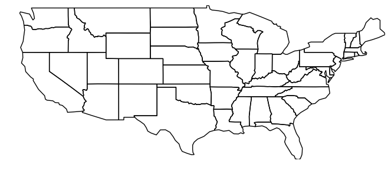
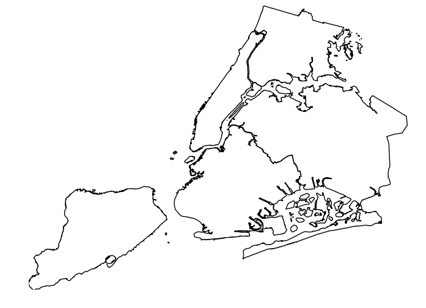
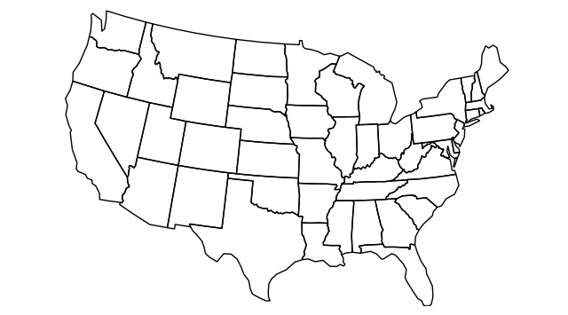
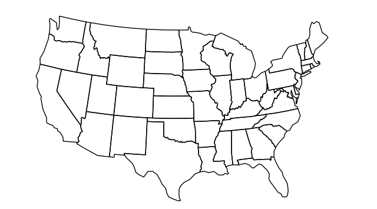
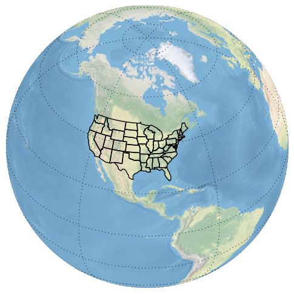
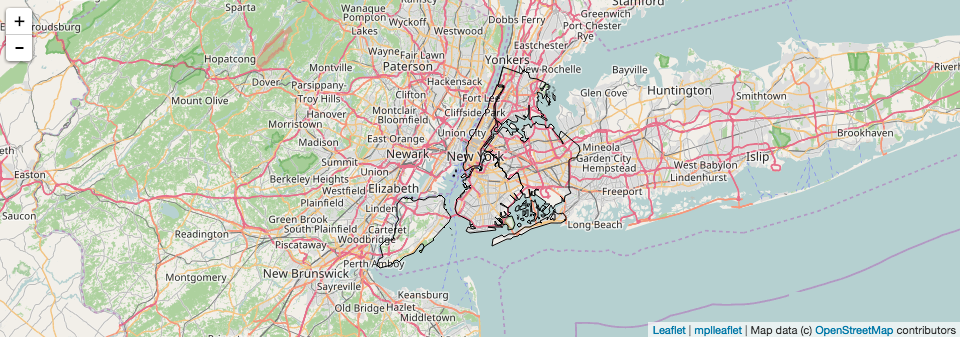

Working with Projections
------------------------

`Projections <https://en.wikipedia.org/wiki/Map_projection>`__ are
``geoplot``'s killer feature. Our explaination is by example. Throughout
this segment of the tutorial we'll use the ``polyplot`` plot type, which
faithfully displays whatever geometry put into it.

.. code:: ipython3

    import sys; sys.path.insert(0, '../../')  # ignore this
    import geopandas as gpd
    import geoplot as gplt
    %matplotlib inline
    
    usa = gpd.read_file("../../data/united_states/usa.geojson")
    usa = usa[~usa['adm1_code'].isin(['USA-3517', 'USA-3563'])]
    
    
    gplt.polyplot(usa).set_aspect("equal")

This map is an example of an unprojected plot: it reproduces our
coordinates as if they were on a flat Cartesian plane. But remember, the
Earth is not a flat surface; it's a sphere. This isn't a map of the
United States that you'd seen in print anywhere because it badly
distorts both of the `two
criteria <http://www.geo.hunter.cuny.edu/~jochen/gtech201/lectures/lec6concepts/Map%20coordinate%20systems/How%20to%20choose%20a%20projection.htm>`__
most projections are evaluated on: *shape* and *area*.

For sufficiently small areas, the amount of distortion is very small.
This map of New York City, for example, is reasonably accurate:

.. code:: ipython3

    boroughs = gpd.read_file("../../data/nyc_boroughs/boroughs.geojson")
    
    gplt.polyplot(boroughs)

.. parsed-literal::

    <matplotlib.axes._subplots.AxesSubplot at 0x114482eb8>

More consequentially, ``geoplot`` returns unprojected plots as pure
``matplotlib`` ``AxesSubplot`` objects, while projected plots, which
require heavy-lifting in the form of coordinate transformations, are
returned as ``cartopy`` ``GeoAxesSubplot`` objects. To understand why
this matters, let's first take a look at how we generate projected
plots, and what they look like.

In the case of the contiguous United States, the projection most often
used is known as the `Albers Equal Area
projection <https://en.wikipedia.org/wiki/Albers_projection>`__. This
projection works by wrapping the Earth around a cone, one that's
particularly well optimized for locations near the middle of the
Northern Hemisphere (and particularly poorly for locations at the
poles).

To place our plot in a projection, we need to pass the projection of
interest to the ``projection`` keyword parameter. ``geoplot`` functions
expect input to come from the ``geoplot.crs`` module, imported as
``gcrs`` by convention.

.. code:: ipython3

    import geoplot.crs as gcrs
    
    # ax = gplt.polyplot(usa, projection=gcrs.AlbersEqualArea()).set_ylim((-1597757.3894385984, 1457718.4893930717))
    # pass
    gplt.polyplot(usa, projection=gcrs.AlbersEqualArea())

``geoplot`` projections are actually a very thin wrapper on
``cartopy.crs`` projections, and every ``cartopy`` projection is
implemented in ``geoplot.crs``. Refer to `this
page <http://scitools.org.uk/cartopy/docs/latest/crs/projections.html>`__
to see the list of projections that ``geoplot`` implements.

.. raw:: html

   <!--
   You may be wondering, if ``geoplot.crs`` is a wrapper on ``cartopy.crs``, why not just use Cartopy CRS objects directly? This comes down to an important implementation detail: when Cartopy CRS objects are used as the library  intends for them to be used, projection geolocation settings are supposed to be defined as parameters to the projection and cannot be modified after instantiation. This means that if you don't explicitly specify otherwise yourself, a Cartopy CRS object will result in a map centered on mid-Africa&mdash;coordinate `(0, 0)`!

   ``geoplot`` avoids forcing this extra work on the user by computing sensible defaults, based on the data provided, when exact settings are not provided. This is why the plot above "just works": ``geoplot`` computed the mean centroid of the polygons and centered the plot on that coordinate in the background. This feature comes at the cost of a little bit of awkwardness, requiring our wrapper classes, but overall the tradeoff seems to be very "worth it".

   -->

At this time, the defaults are still a work in progress, however. If you
look closely at this figure you'll notice that our copy of the United
States is ever so slightly skewed downwards and to the right, indicating
that the default settings ``geoplot`` calculates for us are off. We can
correct this by specifying center coordinates ourselves.

The `center of the contiguous United
States <https://en.wikipedia.org/wiki/Geographic_center_of_the_contiguous_United_States>`__
is 39°50′N 98°35′W. If we provide approximately these coordinates as
``central_latitude`` and ``central_longitude`` coordinates to our
projection, our skew is fixed!

.. code:: ipython3

    # ax = gplt.polyplot(usa, projection=gcrs.AlbersEqualArea(central_longitude=-98, central_latitude=39.5))\
    #         .set_ylim((-1597757.3894385984, 1457718.4893930717))
    # pass
    gplt.polyplot(usa, projection=gcrs.AlbersEqualArea(central_longitude=-98, central_latitude=39.5))

This is the version of the map of the United States that you're probably
most familiar with.

Of course, why stop there? I encourage you to experiment with some of
the crazier projections (like ``Gnomonic``) that ``cartopy`` provides.
Of particular value are global projections, which provide a way of
visualizing your data on top of an actual for-real sphere—neat! A
demonstrative exame is provided below.

.. code:: ipython3

    ax = gplt.polyplot(usa, projection=gcrs.Orthographic())
    ax.set_global()
    ax.gridlines()
    ax.stock_img()

.. parsed-literal::

    <matplotlib.image.AxesImage at 0x11405ce10>

The gallery has an `example <../../examples/los-angeles-flights.html>`__
that further demonstrates these globes and the things you can do with
them.

Now, recall that ``geoplot`` returns unprojected plots as pure
``matplotlib`` ``AxesSubplot`` objects, while projected plots are
returned as ``cartopy`` ``GeoAxesSubplot`` objects. But ``cartopy``
``GeoAxesSublot`` objects cannot be colocated with ``matplotlib``
``AxesSubplot`` objects, nor vice versa! Once you have a graph, you're
stuck in whatever "ecosystem" you chose to be in at runtime. This is the
major reason why we even bother providing an option to get
"inferior-looking" ``AxesSubplot`` output at all: because it can
integrated with other "stuff" in the wider ``matplotlib`` ecosystem.

The biggest reason to ask for ``matplotlib`` output is ``mplleaflet``, a
small library which allows you to place ``matplotlib`` plots on an
interactive `Leaflet <http://leafletjs.com/>`__ webmap:

.. code:: ipython3

    # Code:
    # import mplleaflet
    # gplt.polyplot(boroughs)
    # mplleaflet.display()
    
    # Result:
    Image("./figures/leaflet-webmap-example.png")

For an interactive version, see `this
example <../examples/boston-airbnb-kde.html>`__ or `this
one <../examples/minard-napoleon-russia.html>`__ from the gallery.

`Click here to continue to the next section of the tutorial:
"Plotting" <.>`__.
