Quickstart
==========

In this section we'll do a circuit through what ``geoplot`` can do.

.. code:: ipython3

    import sys; sys.path.insert(0, '../../')  # ignore this
    import geoplot as gplt
    
    %matplotlib inline

Suppose that we have data on localities in the United States. We'll like
to do a bit of exploratory analysis to determine what interesting things
we can find in it.

Our raw data is in the form of a ``shapefile``, and we start off by
loading that data into a ``geopandas`` ``GeoDataFrame`` (if this all
sounds unfamiliar, be sure to read the section on `working with
data <../Data.ipynb>`__ to learn more).

.. code:: ipython3

    import geopandas as gpd
    
    cities = gpd.read_file("../../data/cities/citiesx010g.shp")
    continental_cities = cities[cities['STATE'].map(lambda s: s not in ['PR', 'AK', 'HI', 'VI'])]
    continental_cities = continental_cities[continental_cities['POP_2010'] >= 100000]

.. code:: ipython3

    import pandas as pd
    pd.set_option('max_columns', 6)  # Unclutter display.
    
    continental_cities.head()

.. raw:: html

    

    <table border="1" class="dataframe">
      <thead>
        <tr style="text-align: right;">
          <th></th>
          <th>ANSICODE</th>
          <th>COUNTY</th>
          <th>COUNTYFIPS</th>
          <th>...</th>
          <th>STATE</th>
          <th>STATE_FIPS</th>
          <th>geometry</th>
        </tr>
      </thead>
      <tbody>
        <tr>
          <th>177</th>
          <td>1036030</td>
          <td>Cass</td>
          <td>017</td>
          <td>...</td>
          <td>ND</td>
          <td>38</td>
          <td>POINT (-96.78980339999998 46.87718630000012)</td>
        </tr>
        <tr>
          <th>373</th>
          <td>979426</td>
          <td>Monroe</td>
          <td>055</td>
          <td>...</td>
          <td>NY</td>
          <td>36</td>
          <td>POINT (-77.61555679999998 43.15478450000012)</td>
        </tr>
        <tr>
          <th>378</th>
          <td>979539</td>
          <td>Onondaga</td>
          <td>067</td>
          <td>...</td>
          <td>NY</td>
          <td>36</td>
          <td>POINT (-76.14742439999998 43.04812210000017)</td>
        </tr>
        <tr>
          <th>386</th>
          <td>978764</td>
          <td>Erie</td>
          <td>029</td>
          <td>...</td>
          <td>NY</td>
          <td>36</td>
          <td>POINT (-78.87836889999994 42.8864468000001)</td>
        </tr>
        <tr>
          <th>426</th>
          <td>618227</td>
          <td>Middlesex</td>
          <td>017</td>
          <td>...</td>
          <td>MA</td>
          <td>25</td>
          <td>POINT (-71.31617179999989 42.63342470000003)</td>
        </tr>
      </tbody>
    </table>
    
5 rows × 17 columns

    

Let's use ``pointplot`` (`docs <../pointplot.html>`__) to see where our
cities are.

.. code:: ipython3

    gplt.pointplot(continental_cities)

.. parsed-literal::

    <matplotlib.axes._subplots.AxesSubplot at 0x7f061b102860>

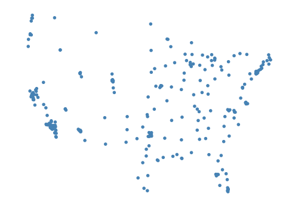

Hmm. This data isn't easily interpretable because it lacks geospatial
context: it's impossible to tell where these points actually are,
exactly. Let's use a ``polyplot`` (`docs <../polyplot.html>`__) to add
the US states to the map.

.. code:: ipython3

    usa = gpd.read_file("../../data/united_states/usa.geojson")
    continental_usa = usa[~usa['adm1_code'].isin(['USA-3517', 'USA-3563'])]
    
    ax = gplt.polyplot(continental_usa)
    gplt.pointplot(continental_cities, ax=ax)
    ax.set_aspect("equal")

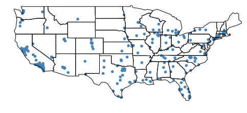

This is better, but if you're familiar with typical depictions of the
United States, you'll notice that this map seems a bit distorted.

You may recall from geography that the Earth, being a sphere, is
impossible to accurately potray on a two-dimensional map; the best we
can do is pick a method of "unpeeling" it, a projection, which is
well-suited for the purpose we have in mind.

In this case we haven't used any projection at all: we're plotting using
raw coordinates.

So we can "fix" the distortion by using an appropriate projection. The
Albers equal area projection is most common in the United States.

.. code:: ipython3

    import geoplot.crs as gcrs
    
    proj = gcrs.AlbersEqualArea()# central_longitude=-98, central_latitude=39.5)
    
    ax = gplt.polyplot(continental_usa, projection=proj)
    gplt.pointplot(continental_cities, ax=ax, projection=proj)
    
    # ax.set_ylim((-1597757, 1457718)); pass

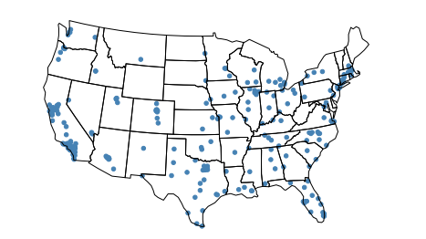

.. code:: ipython3

    continental_cities.columns

.. parsed-literal::

    Index(['ANSICODE', 'COUNTY', 'COUNTYFIPS', 'ELEV_IN_FT', 'ELEV_IN_M',
           'FEATURE', 'FEATURE2', 'GNIS_ID', 'LATITUDE', 'LONGITUDE', 'NAME',
           'POP_2010', 'PopPlLat', 'PopPlLong', 'STATE', 'STATE_FIPS', 'geometry'],
          dtype='object')

To learn more about this, and to see what options you have available, be
sure to read the section of the tutorial on
`projections <../Projections.ipynb>`__.

Ok great. Let's adjust this plot to make it a bit more informative. Our
data contains information on the population of our cities; let's encode
this using the ``scale`` of our points.

.. code:: ipython3

    proj = gcrs.AlbersEqualArea(central_longitude=-98, central_latitude=39.5)
    
    ax = gplt.polyplot(continental_usa, projection=proj)
    gplt.pointplot(continental_cities, 
                   scale='POP_2010',
                   limits=(1, 80),  # Make our largest city 80x our smallest.
                   ax=ax, projection=proj)
    
    ax.set_ylim((-1597757, 1457718)); pass

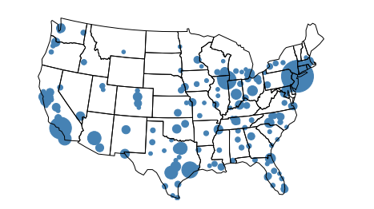

Let's add some visual configuration to prettify the map and keep the
points for dissappearing inside of one another...

.. code:: ipython3

    proj = gcrs.AlbersEqualArea(central_longitude=-98, central_latitude=39.5)
    
    ax = gplt.polyplot(continental_usa, 
                       projection=proj,
                       zorder=-1,  # Put the polyplot below the pointplot.
                       linewidth=0.5,  # Make state borders thinner.
                       figsize=(12, 12))  # Increase the size of the figure.
    gplt.pointplot(continental_cities, 
                   scale='POP_2010',
                   limits=(1, 80),
                   linewidth=0.5,  # Give the points a border...
                   edgecolor='black',  # ...and color it black.
                   ax=ax, projection=proj)
    
    ax.set_ylim((-1597757, 1457718)); pass

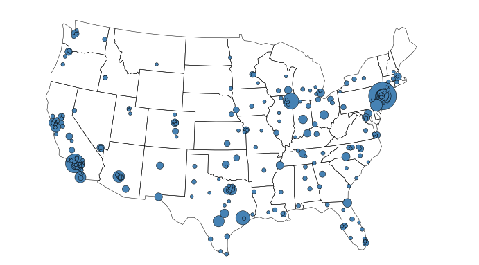

Great! But to make the scale more obvious, let's add a legend.

.. code:: ipython3

    proj = gcrs.AlbersEqualArea(central_longitude=-98, central_latitude=39.5)
    
    ax = gplt.polyplot(continental_usa, 
                       projection=proj,
                       zorder=-1,
                       linewidth=0.5,
                       figsize=(12, 12))
    gplt.pointplot(continental_cities, 
                   scale='POP_2010',
                   limits=(1, 80),
                   linewidth=0.5,
                   edgecolor='black',
                   legend=True,  # Add a legend.
                   legend_values=[8000000, 6000000, 4000000, 2000000, 100000],
                   legend_labels=['8 million', '6 million', '4 million', '2 million', '100 thousand'],
                   # Change the legend display to better fit our values.
                   legend_kwargs={'frameon': False, 'loc': 'lower right'},
                   # Turn off the legend frame and pin it to the bottom right.
                   ax=ax, projection=proj)
    
    ax.set_ylim((-1597757, 1457718)); pass

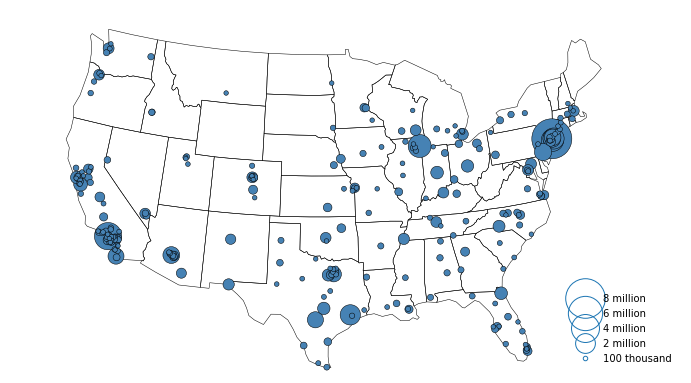

Great! We can emphasize even further by also scaling the ``hue``, and
giving the whole thing a title.

.. code:: ipython3

    import matplotlib.pyplot as plt
    
    proj = gcrs.AlbersEqualArea(central_longitude=-98, central_latitude=39.5)
    
    ax = gplt.polyplot(continental_usa, 
                       projection=proj,
                       zorder=-1,
                       linewidth=0.5,
                       figsize=(12, 12))
    gplt.pointplot(continental_cities, 
                   scale='POP_2010',
                   limits=(1, 80),
                   hue='POP_2010',  # Add a hue variable.
                   cmap='Blues',  # cf. matplotlib.org/examples/color/colormaps_reference.html
                   legend_var='scale',  # Keep the legend based on scale, not on hue.
                   linewidth=0.5,
                   edgecolor='black',
                   legend=True,
                   legend_values=[8000000, 6000000, 4000000, 2000000, 100000],
                   legend_labels=['8 million', '6 million', '4 million', '2 million', '100 thousand'],
                   legend_kwargs={'frameon': False, 'loc': 'lower right'},
                   ax=ax, projection=proj)
    
    ax.set_ylim((-1597757, 1457718)); pass
    
    plt.title("Cities in the contiguous United States, 2010")  # Add a title!

.. parsed-literal::

    <matplotlib.text.Text at 0x7f061a34b3c8>

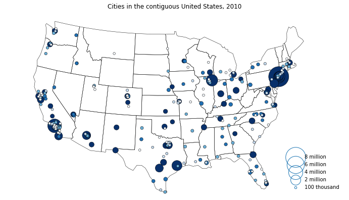

And there you go!

This plot—which you can see as a `standalone
example <../examples/largest-cities-usa.html>`__ in the
Gallery—demonstrates many of the options you have available for
configuring things to look the way you want them.

So far we've loaded some data, put it on a map, loaded some shapes,
projected the two, and explored what we can do with them using a
``pointplot``—one of the six map types available in ``geoplot``.

The API for the remaining five plot types is very similar to what we
just saw, and so for the remainder of this quick walkthrough let's look
at some simple examples from other parts of ``geoplot``.

Let's start with traffic collisions in New York City. As you might
expect, these tend to happen in certain places more often than others;
but can we figure out where? This is a bit difficult to do with just
points on a map: there are too many accidents, resulting in too much
overplotting. Instead, let's use ``kdeplot``
(`docs <../polyplot.html>`__) to tell this story.

First we load the data...

.. code:: ipython3

    import pandas as pd
    import shapely
    
    collisions = pd.read_csv("../../data/nyc_collisions/NYPD_Motor_Vehicle_Collisions_2016.csv", index_col=0)
    collisions = collisions[collisions['LOCATION'].notnull()]
    collision_points = collisions.apply(lambda srs: shapely.geometry.Point(srs['LONGITUDE'], srs['LATITUDE']),
                                        axis='columns')
    collisions = gpd.GeoDataFrame(collisions, geometry=collision_points)
    
    boroughs = gpd.read_file("../../data/nyc_boroughs/boroughs.geojson", driver='GeoJSON')

And then we plot it!

.. code:: ipython3

    ax = gplt.kdeplot(collisions.sample(5000), 
                      projection=gcrs.AlbersEqualArea(), 
                      shade=True,  # Shade the areas or draw relief lines?
                      shade_lowest=False,  # Don't shade near-zeros.
                      clip=boroughs.geometry,  # Constrain the heatmap to this area.
                      figsize=(12,12))
    gplt.polyplot(boroughs, projection=gcrs.AlbersEqualArea(), ax=ax)

.. parsed-literal::

    <cartopy.mpl.geoaxes.GeoAxesSubplot at 0x7f0615cfc588>

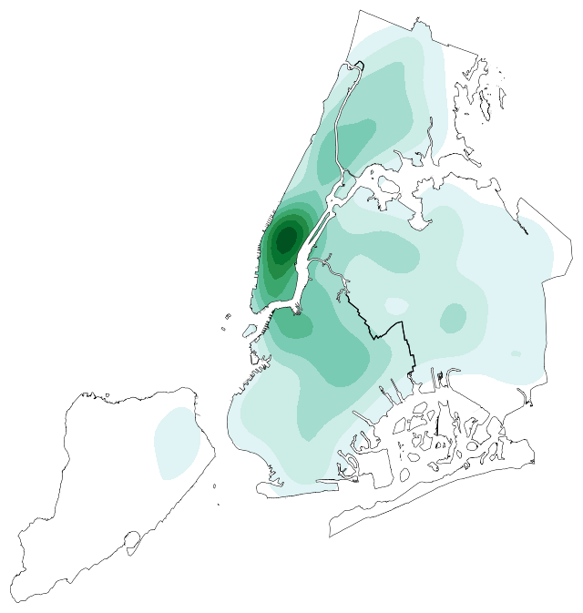

Looks like traffic accidents are centered on Midtown.

The two plot types so far are concerned with points. Something we're
interested not in points but in the movement between them. In these
cases we can use a ``sankey`` diagram (`docs <../sankey.html>`__), like
this one of road traffic volumes in Washington DC:

.. code:: ipython3

    dc = gpd.read_file("../../data/us_roads/District_Sections.shp")
    
    
    gplt.sankey(dc, 
                path=dc.geometry,  # The paths are roadway segments.
                projection=gcrs.AlbersEqualArea(), 
                scale='aadt',  # The variable we'll use to scale the result.
                limits=(0.1, 10),  # The limits in terms of width.
                figsize=(12,12))

.. parsed-literal::

    <cartopy.mpl.geoaxes.GeoAxesSubplot at 0x7f06150884e0>

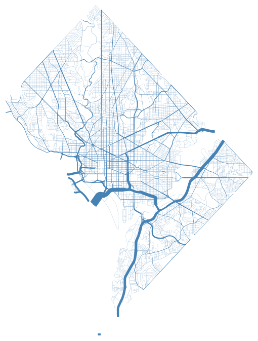

At other times our data comes attached polygons instead of points. For
these we can create a ``choropleth`` (`docs <../choropleth>`__):

.. code:: ipython3

    # Load the data.
    census_tracts = gpd.read_file("../../data/ny_census_2010/cty036.shp")
    percent_white = census_tracts['WHITE'] / census_tracts['POP2000']
    
    
    # Plot the data.
    gplt.choropleth(census_tracts, 
                    hue=percent_white,  # Display data, passed as a Series
                    projection=gcrs.AlbersEqualArea(),
                    cmap='Purples', 
                    linewidth=0.5, 
                    k=None,  # Do not bin our counties.
                    legend=True,
                    figsize=(12, 12))

.. parsed-literal::

    <cartopy.mpl.geoaxes.GeoAxesSubplot at 0x7f060e2eecc0>

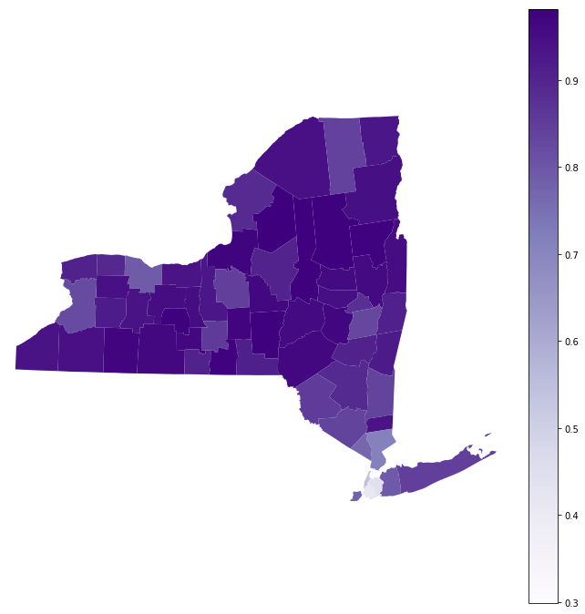

Or a ``cartogram`` (`docs <../cartogram.html>`__):

.. code:: ipython3

    obesity = pd.read_csv("../../data/obesity/obesity_by_state.tsv", sep='\t')
    usa = gpd.read_file("../../data/united_states/usa.geojson")
    continental_usa = usa[~usa['adm1_code'].isin(['USA-3517', 'USA-3563'])]
    continental_usa['State'] = [
        'Minnesota', 'Montana', 'North Dakota', 'Idaho', 'Washington', 'Arizona',
        'California', 'Colorado', 'Nevada', 'New Mexico', 'Oregon', 'Utah', 'Wyoming',
        'Arkansas', 'Iowa', 'Kansas', 'Missouri', 'Nebraska', 'Oklahoma', 'South Dakota',
        'Louisiana', 'Texas', 'Connecticut', 'Massachusetts', 'New Hampshire',
        'Rhode Island', 'Vermont', 'Alabama', 'Florida', 'Georgia', 'Mississippi',
        'South Carolina', 'Illinois', 'Indiana', 'Kentucky', 'North Carolina', 'Ohio',
        'Tennessee', 'Virginia', 'Wisconsin', 'West Virginia', 'Delaware', 'District of Columbia',
        'Maryland', 'New Jersey', 'New York', 'Pennsylvania', 'Maine', 'Michigan'
    ]
    continental_usa['Obesity Rate'] = continental_usa['State'].map(
        lambda state: obesity.query("State == @state").iloc[0]['Percent']
    )
    
    
    # Plot the data.
    ax = gplt.cartogram(continental_usa, scale='Obesity Rate',
                        projection=gcrs.AlbersEqualArea(central_longitude=-98, central_latitude=39.5),
                        limits=(0.75, 1),
                        linewidth=0.5, 
                        facecolor='steelblue', 
                        trace_kwargs={'linewidth': 0.5},
                        figsize=(12, 12))
    ax.set_ylim((-1597757.3894385984, 1457718.4893930717))

.. parsed-literal::

    /home/alex/anaconda3/envs/geoplot/lib/python3.5/site-packages/ipykernel/__main__.py:12: SettingWithCopyWarning: 
    A value is trying to be set on a copy of a slice from a DataFrame.
    Try using .loc[row_indexer,col_indexer] = value instead
    
    See the caveats in the documentation: http://pandas.pydata.org/pandas-docs/stable/indexing.html#indexing-view-versus-copy
    /home/alex/anaconda3/envs/geoplot/lib/python3.5/site-packages/ipykernel/__main__.py:15: SettingWithCopyWarning: 
    A value is trying to be set on a copy of a slice from a DataFrame.
    Try using .loc[row_indexer,col_indexer] = value instead
    
    See the caveats in the documentation: http://pandas.pydata.org/pandas-docs/stable/indexing.html#indexing-view-versus-copy

.. parsed-literal::

    (-1597757.3894385984, 1457718.4893930717)

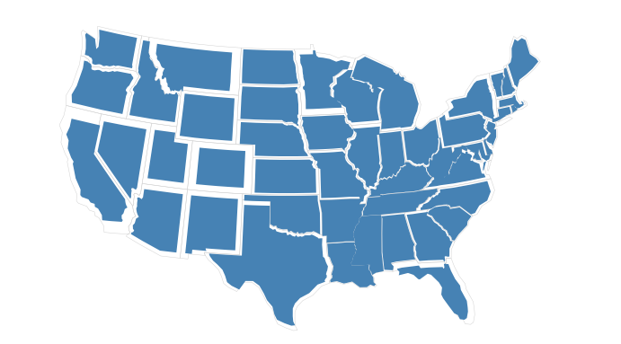

There's one more plot type, ``aggplot``, which looks a lot like a
choropleth but is a bit more complex because it attempts to handle
aggregating points into polygons for you. To see what that's about,
`read its documentation <../aggplot.html>`__.

That concludes our quick introduction to ``geoplot``. If you're a novice
with geospatial data in Python, I suggest leafing through the rest of
the tutorial materials. To see more examples refer to the
`Gallery <../Gallery.html>`__. To get started using ``geoplot`` in your
own projects, refer to `Installation <../Installation.html>`__ and the
`API Reference <../api.html>`__.
