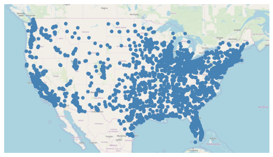
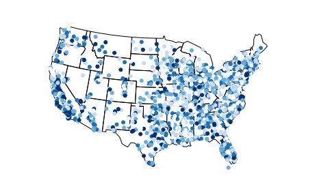
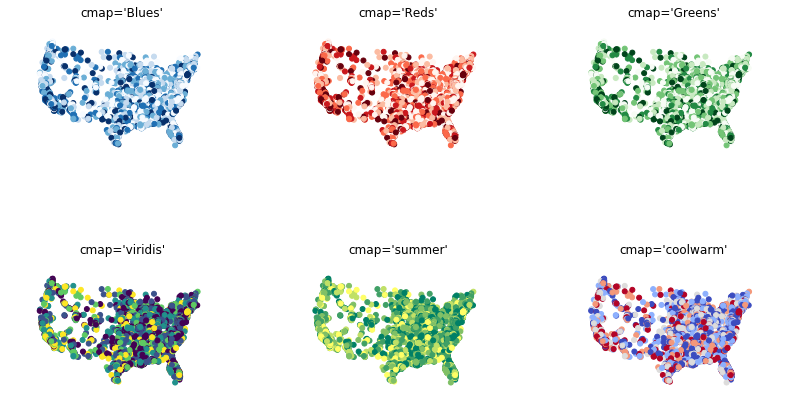
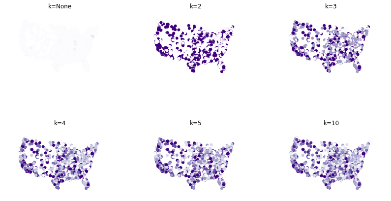
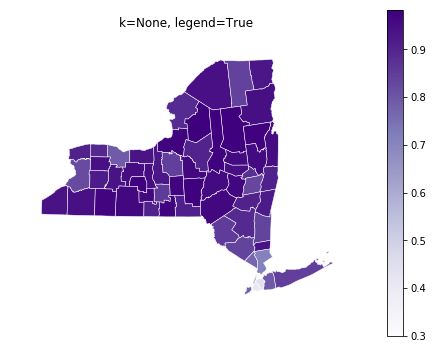
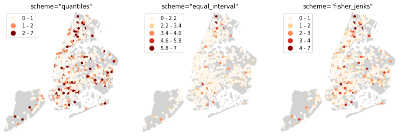
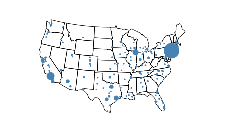
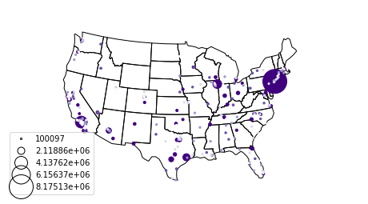
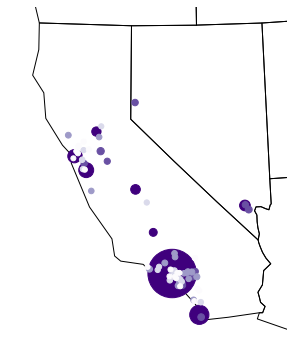

Customizing Plots
=================

``geoplot`` plots have a large number of styling parameters, both
cosmetic (for example, the colors of the map borders) and informative
(for example, the choice of colormap). This section of the tutorial
explains how these work.

I recommend following along with this tutorial interactively using
`Binder <https://mybinder.org/v2/gh/ResidentMario/geoplot/master?filepath=notebooks/tutorials/Customizing_Plots.ipynb>`__.

Position
--------

A `visual
variable <https://wiki.gis.com/wiki/index.php/Visual_variable>`__ is an
attribute of a plot that is used to convey information. One such
variable that every map has in common is **position**.

.. code:: ipython3

    %matplotlib inline
    import geopandas as gpd
    import geoplot as gplt
    
    continental_usa_cities = gpd.read_file(gplt.datasets.get_path('usa_cities'))
    continental_usa_cities = continental_usa_cities.query('STATE not in ["AK", "HI", "PR"]')
    contiguous_usa = gpd.read_file(gplt.datasets.get_path('contiguous_usa'))

.. code:: ipython3

    import geoplot.crs as gcrs
    
    ax = gplt.webmap(contiguous_usa, projection=gcrs.WebMercator())
    gplt.pointplot(continental_usa_cities, ax=ax)

.. parsed-literal::

    <cartopy.mpl.geoaxes.GeoAxesSubplot at 0x12591a940>

This plot shows cities in the continental United States with greater
than 10,000 population. It has only one visual variable, position. By
examining the distribution of the points, we see that the part of the
United States around the Rocky Mountains is more sparely populated than
the coasts.

Hue
---

The “hue” parameter in ``geoplot`` adds **color** as a visual variable
in your plot.

   This parameter is called “hue”, not “color”, because ``color`` is a
   reserved keyword in the ``matplotlib`` API.

.. code:: ipython3

    ax = gplt.webmap(contiguous_usa, projection=gcrs.WebMercator())
    gplt.pointplot(continental_usa_cities, hue='POP_2010', k=5, cmap='Blues', ax=ax)

.. parsed-literal::

    /Users/alex/miniconda3/envs/geoplot-dev/lib/python3.6/site-packages/scipy/stats/stats.py:1633: FutureWarning: Using a non-tuple sequence for multidimensional indexing is deprecated; use `arr[tuple(seq)]` instead of `arr[seq]`. In the future this will be interpreted as an array index, `arr[np.array(seq)]`, which will result either in an error or a different result.
      return np.add.reduce(sorted[indexer] * weights, axis=axis) / sumval

.. parsed-literal::

    <cartopy.mpl.geoaxes.GeoAxesSubplot at 0x126222198>

In this case we set ``hue='POP_2010'``, telling ``geoplot`` to color the
points based on population as of the 2010 census. In this new map, the
darker the point, the more populous the city.

There are a number of variables for controlling colors. One is ``cmap``,
which determines which ``matplotlib`` colormap is used:

.. code:: ipython3

    import matplotlib.pyplot as plt
    proj = gcrs.AlbersEqualArea(central_longitude=-98, central_latitude=39.5)
    fig, axarr = plt.subplots(2, 3, figsize=(14, 8), subplot_kw={'projection': proj})
    pointplot_kwargs = {'hue': 'POP_2010'}
    
    gplt.pointplot(continental_usa_cities, ax=axarr[0][0], cmap='Blues', k=5, **pointplot_kwargs)
    axarr[0][0].set_title("cmap='Blues'")
    gplt.pointplot(continental_usa_cities, ax=axarr[0][1], cmap='Reds', k=5, **pointplot_kwargs)
    axarr[0][1].set_title("cmap='Reds'")
    gplt.pointplot(continental_usa_cities, ax=axarr[0][2], cmap='Greens', k=5, **pointplot_kwargs)
    axarr[0][2].set_title("cmap='Greens'")
    gplt.pointplot(continental_usa_cities, ax=axarr[1][0], cmap='viridis', k=5, **pointplot_kwargs)
    axarr[1][0].set_title("cmap='viridis'")
    gplt.pointplot(continental_usa_cities, ax=axarr[1][1], cmap='summer', k=5, **pointplot_kwargs)
    axarr[1][1].set_title("cmap='summer'")
    gplt.pointplot(continental_usa_cities, ax=axarr[1][2], cmap='coolwarm', k=5, **pointplot_kwargs)
    axarr[1][2].set_title("cmap='coolwarm'")

.. parsed-literal::

    /Users/alex/miniconda3/envs/geoplot-dev/lib/python3.6/site-packages/scipy/stats/stats.py:1633: FutureWarning: Using a non-tuple sequence for multidimensional indexing is deprecated; use `arr[tuple(seq)]` instead of `arr[seq]`. In the future this will be interpreted as an array index, `arr[np.array(seq)]`, which will result either in an error or a different result.
      return np.add.reduce(sorted[indexer] * weights, axis=axis) / sumval

.. parsed-literal::

    Text(0.5, 1.0, "cmap='coolwarm'")

The **colormap** is the color scale of your plot, and it has big visual
impact on your plot. There are over fifty named colormaps in
``matplotlib``—`the reference page has the full
list <https://matplotlib.org/3.1.0/tutorials/colors/colormaps.html>`__.
Naturally it is also possible to `create your own
colormap <https://matplotlib.org/3.1.0/tutorials/colors/colormap-manipulation.html>`__;
there is an
`example <https://residentmario.github.io/geoplot/gallery/plot_minard_napoleon_russia.html>`__
of this in the Gallery.

The `ColorBrewer
paper <http://citeseerx.ist.psu.edu/viewdoc/download?doi=10.1.1.361.6082&rep=rep1&type=pdf>`__
is a great summary of color theory as it pertains to mapmaking, and is a
recommended read if you want to learn more about picking a color scale.

Suppose we’ve picked a colormap. The next choice we have to make is how
to assign colors. There are two ways of assigning colors to geometries:
a continuous colormap, which just applies colors on a spectrum of data;
or a categorical colormap, which buckets data and applies colors not to
those buckets.

.. code:: ipython3

    import matplotlib.pyplot as plt
    proj = gcrs.AlbersEqualArea(central_longitude=-98, central_latitude=39.5)
    fig, axarr = plt.subplots(2, 3, figsize=(14, 8), subplot_kw={'projection': proj})
    pointplot_kwargs = {'hue': 'POP_2010', 'cmap': 'Purples'}
    
    gplt.pointplot(continental_usa_cities, ax=axarr[0][0], k=None, **pointplot_kwargs)
    axarr[0][0].set_title("k=None")
    gplt.pointplot(continental_usa_cities, ax=axarr[0][1], k=2, **pointplot_kwargs)
    axarr[0][1].set_title("k=2")
    gplt.pointplot(continental_usa_cities, ax=axarr[0][2], k=3, **pointplot_kwargs)
    axarr[0][2].set_title("k=3")
    gplt.pointplot(continental_usa_cities, ax=axarr[1][0], k=4, **pointplot_kwargs)
    axarr[1][0].set_title("k=4")
    gplt.pointplot(continental_usa_cities, ax=axarr[1][1], k=5, **pointplot_kwargs)
    axarr[1][1].set_title("k=5")
    gplt.pointplot(continental_usa_cities, ax=axarr[1][2], k=10, **pointplot_kwargs)
    axarr[1][2].set_title("k=10")

.. parsed-literal::

    /Users/alex/miniconda3/envs/geoplot-dev/lib/python3.6/site-packages/scipy/stats/stats.py:1633: FutureWarning: Using a non-tuple sequence for multidimensional indexing is deprecated; use `arr[tuple(seq)]` instead of `arr[seq]`. In the future this will be interpreted as an array index, `arr[np.array(seq)]`, which will result either in an error or a different result.
      return np.add.reduce(sorted[indexer] * weights, axis=axis) / sumval

.. parsed-literal::

    Text(0.5, 1.0, 'k=10')

The ``k`` parameter controls how many colors are used. If it is set to
``None``, as in the first plot, a continuous colormap is used. Otherwise
as many colors are used as are set.

This dataset happens to be an example of a poor choice for a continuous
colormap because there are outlier observations, like New York City,
which are orders of magnitude larger than the mean value, rendering the
(linear) color scale ineffectual. Here is an example where it is a more
appropriate choice (in a plot measuring the percentage of the population
of each county in New York which is white):

.. code:: ipython3

    ny_census_tracts = gpd.read_file(gplt.datasets.get_path('ny_census'))
    ny_census_tracts = ny_census_tracts.assign(
        percent_white=ny_census_tracts['WHITE'] / ny_census_tracts['POP2000']
    )
    gplt.choropleth(
        ny_census_tracts, hue='percent_white',
        cmap='Purples', linewidth=0.5, edgecolor='white', k=None, legend=True,
        projection=gcrs.WebMercator()
    )

.. parsed-literal::

    <cartopy.mpl.geoaxes.GeoAxesSubplot at 0x12b0c04e0>

Another good example is the `Parking
Tickets <https://residentmario.github.io/geoplot/gallery/plot_nyc_parking_tickets.html>`__
demo in the Gallery.

If you are using a categorical colormap, there is one last consideration
you need to make: what `binning
scheme <https://en.wikipedia.org/wiki/Data_binning>`__ to use.

A binning scheme is a methodology for splitting a continuous dataset
into discrete bins (which the colormap will then be applied to). The
default binning scheme in ``geoplot`` is ``quantiles``, which bins
observations into classes of different sizes but the same numbers of
observations. ``equal_interval`` will creates bins that are the same
size, but potentially containing different numbers of observations.
Finally, the more complicated ``fisher_jenks`` scheme is an intermediate
between the two; you can read about it `on
Wikipedia <https://en.wikipedia.org/wiki/Jenks_natural_breaks_optimization>`__.

To use a non-default binning scheme, pass its name to the ``scheme``
parameter. The following plot of collisions in New York City by number
of injuries demonstrates.

.. code:: ipython3

    nyc_boroughs = gpd.read_file(gplt.datasets.get_path('nyc_boroughs'))
    nyc_fatal_collisions = gpd.read_file(gplt.datasets.get_path('nyc_fatal_collisions'))
    nyc_injurious_collisions = gpd.read_file(gplt.datasets.get_path('nyc_injurious_collisions'))

.. code:: ipython3

    import matplotlib.pyplot as plt
    
    polyplot_kwargs = {'facecolor': 'lightgray', 'edgecolor': 'white'}
    pointplot_kwargs = {
        'hue': 'NUMBER OF PERSONS INJURED', 'linewidth': 0,
        's': 5, 'zorder': 10, 'legend': True, 'cmap': 'OrRd', 'k': 5
    }
    
    proj = gcrs.AlbersEqualArea(central_latitude=40.7128, central_longitude=-74.0059)
    fig, axarr = plt.subplots(1, 3, figsize=(14, 8), subplot_kw={'projection': proj})
    
    gplt.pointplot(
        nyc_injurious_collisions.head(1000), scheme='quantiles', ax=axarr[0], **pointplot_kwargs
    )
    gplt.polyplot(nyc_boroughs, **polyplot_kwargs, ax=axarr[0])
    axarr[0].set_title('scheme="quantiles"')
    
    gplt.pointplot(
        nyc_injurious_collisions.head(1000), scheme='equal_interval', ax=axarr[1], **pointplot_kwargs
    )
    gplt.polyplot(nyc_boroughs, **polyplot_kwargs, projection=proj, ax=axarr[1])
    axarr[1].set_title('scheme="equal_interval"')
    
    gplt.pointplot(
        nyc_injurious_collisions.head(1000), scheme='fisher_jenks', ax=axarr[2], **pointplot_kwargs
    )
    gplt.polyplot(nyc_boroughs, **polyplot_kwargs, projection=proj, ax=axarr[2])
    axarr[2].set_title('scheme="fisher_jenks"')

.. parsed-literal::

    /Users/alex/miniconda3/envs/geoplot-dev/lib/python3.6/site-packages/scipy/stats/stats.py:1633: FutureWarning: Using a non-tuple sequence for multidimensional indexing is deprecated; use `arr[tuple(seq)]` instead of `arr[seq]`. In the future this will be interpreted as an array index, `arr[np.array(seq)]`, which will result either in an error or a different result.
      return np.add.reduce(sorted[indexer] * weights, axis=axis) / sumval

.. parsed-literal::

    Text(0.5, 1.0, 'scheme="fisher_jenks"')

As you can see, which binning scheme you choose has a major visual
impact on the result that you get. Which binning scheme works best is
dependent both on the shape of the data and the insight you are trying
to communicate in the plot.

**Power User Feature: Colormap Normalization**

Passing a `colormap
normalizer <https://matplotlib.org/users/colormapnorms.html>`__ to the
``norm`` parameter will allow you to modify the colormap fitted to your
dataset to suit your needs. Alternatively, you can assume full control
of your colormap by constructing your own. See the section of the
``matplotlib`` documentation on `colormap
manipulation <https://matplotlib.org/3.1.1/tutorials/colors/colormap-manipulation.html>`__
to learn more, and see the `Napoleon sankey
demo <https://residentmario.github.io/geoplot/gallery/plot_minard_napoleon_russia.html>`__
in the Gallery for an example application.

Scale
-----

Another visual variable present in some plots in ``geoplot`` is
**scale**.

.. code:: ipython3

    large_continental_usa_cities = continental_usa_cities.query('POP_2010 > 100000')
    
    ax = gplt.pointplot(
        large_continental_usa_cities, projection=gcrs.AlbersEqualArea(), scale='POP_2010', limits=(2, 30)
    )
    gplt.polyplot(contiguous_usa, ax=ax)

.. parsed-literal::

    <cartopy.mpl.geoaxes.GeoAxesSubplot at 0x12acaaba8>

Scale uses the size of the feature to communication information about
its magnitude. For example in this plot we can see more easily than in
the ``hue``-based plots how much larger certain cities (like New York
City and Los Angeles) are than others.

You can adjust the minimum and maximum size of the of the plot elements
to your liking using the ``limits`` parameter.

**Power User Feature: Custom Scaling Functions**

   ``geoplot`` uses a linear scale by default. To use a different scale,
   like e.g. logarithmic, pass a scaling function to the ``scale_func``
   parameter. The `Pointplot Scale
   Functions <https://residentmario.github.io/geoplot/gallery/plot_usa_city_elevations.html>`__
   demo in the
   `Gallery <https://residentmario.github.io/geoplot/gallery/index.html>`__
   demonstrates how this works.

Legend
------

A `legend <http://wiki.gis.com/wiki/index.php/Map_legend>`__ provides a
reference on the values that correspond to th visual variables in your
plot. Legends are an important feature because they make your map
interpretable. Without a legend, you can only map visual variables to
relative magnitudes (e.g. you know which of two cities is bigger in the
map above). With a legend, you can also map them to actual ranges of
values as well.

To add a legend to your plot, set ``legend=True``.

.. code:: ipython3

    ax = gplt.pointplot(
        large_continental_usa_cities, projection=gcrs.AlbersEqualArea(),
        scale='POP_2010', limits=(2, 30),
        hue='POP_2010', cmap='Purples', k=5,
        legend=True, legend_var='hue'
    )
    gplt.polyplot(contiguous_usa, ax=ax)

.. parsed-literal::

    /Users/alex/miniconda3/envs/geoplot-dev/lib/python3.6/site-packages/scipy/stats/stats.py:1633: FutureWarning: Using a non-tuple sequence for multidimensional indexing is deprecated; use `arr[tuple(seq)]` instead of `arr[seq]`. In the future this will be interpreted as an array index, `arr[np.array(seq)]`, which will result either in an error or a different result.
      return np.add.reduce(sorted[indexer] * weights, axis=axis) / sumval

.. parsed-literal::

    <cartopy.mpl.geoaxes.GeoAxesSubplot at 0x12ac69518>

.. image:: Customizing_Plots_files/Customizing_Plots_22_2.png

With the addition of the legend we can now do things like pick out which
are >3.4 million in population.

To switch to a scale-based legend instead of a color-based one, set
``legend_var``:

.. code:: ipython3

    ax = gplt.pointplot(
        large_continental_usa_cities, projection=gcrs.AlbersEqualArea(),
        scale='POP_2010', limits=(2, 30),
        hue='POP_2010', cmap='Purples',  k=5,
        legend=True, legend_var='scale'
    )
    gplt.polyplot(contiguous_usa, ax=ax)

.. parsed-literal::

    /Users/alex/miniconda3/envs/geoplot-dev/lib/python3.6/site-packages/scipy/stats/stats.py:1633: FutureWarning: Using a non-tuple sequence for multidimensional indexing is deprecated; use `arr[tuple(seq)]` instead of `arr[seq]`. In the future this will be interpreted as an array index, `arr[np.array(seq)]`, which will result either in an error or a different result.
      return np.add.reduce(sorted[indexer] * weights, axis=axis) / sumval

.. parsed-literal::

    <cartopy.mpl.geoaxes.GeoAxesSubplot at 0x12ad0aeb8>

Use ``legend_values`` and ``legend_labels`` to customize the markers and
labels in the legend, respectively:

.. code:: ipython3

    ax = gplt.pointplot(
        large_continental_usa_cities, projection=gcrs.AlbersEqualArea(),
        scale='POP_2010', limits=(2, 30),
        hue='POP_2010', cmap='Purples', k=5,
        legend=True, legend_var='scale',
        legend_kwargs={'bbox_to_anchor': (0.92, 0.9), 'frameon': False},
        legend_values=[8000000, 6000000, 4000000, 2000000, 100000],
        legend_labels=['8 million', '6 million', '4 million', '2 million', '100 thousand']
    )
    gplt.polyplot(contiguous_usa, ax=ax)

.. parsed-literal::

    /Users/alex/miniconda3/envs/geoplot-dev/lib/python3.6/site-packages/scipy/stats/stats.py:1633: FutureWarning: Using a non-tuple sequence for multidimensional indexing is deprecated; use `arr[tuple(seq)]` instead of `arr[seq]`. In the future this will be interpreted as an array index, `arr[np.array(seq)]`, which will result either in an error or a different result.
      return np.add.reduce(sorted[indexer] * weights, axis=axis) / sumval

.. parsed-literal::

    <cartopy.mpl.geoaxes.GeoAxesSubplot at 0x12a61c4a8>

**Power User Feature: Custom Legends**

   You can fine-tune the appearance of the legend even further using
   ``legend_kwargs`` parameter. This is demonstrated in the plot above,
   which uses
   ``legend_kwargs={'bbox_to_anchor': (0.92, 0.9), 'frameon': False}``
   to move the legend to a specific location on the plot and to remove
   the default legend box frame.

   If you specify a ``hue`` legend, and ``k != None``, then a
   ``matplotlib`` ``Legend`` will be used. A reference to the parameters
   available is in `the matplotlib
   documentation <https://matplotlib.org/3.1.0/api/_as_gen/matplotlib.pyplot.legend.html>`__.
   If you specify a ``hue`` legend, and ``k == None``, then a
   ``matplotlib`` ``colorbar`` will be used instead. This legend has
   different parameters; a reference to the parameters available is on a
   different page in `the matplotlib
   documentation <https://matplotlib.org/3.1.0/api/_as_gen/matplotlib.pyplot.colorbar.html>`__.

   Keywords starting with ``marker`` (e.g. ``marker``,
   ``markeredgecolor``, ``markeredgewidth``, ``markerfacecolor``, and
   ``markersize``) `will be passed through the legend down to the legend
   markers <https://github.com/ResidentMario/geoplot/issues/35#issuecomment-507196579>`__.

Extent
------

The **extent** of a plot is the span of its axes. In ``geoplot`` it is
formatted as a tuple of
``(min_longitude, min_latitude, max_longitude, max_latitude)``. For
example, a plot covering the entire world would have a span of
``(-180, -180, 180, 180)``.

The ``extent`` argument can be used to set the extent of a plot
manually. This can be used to change the focus of a map. For example,
here’s a map of just populous cities in the state of California.

.. code:: ipython3

    extent = contiguous_usa.query('state == "California"').total_bounds
    extent = extent + [-0.5, -0.5, 0.5, 0.5]
    
    proj = gcrs.AlbersEqualArea(central_longitude=-119.1786315, central_latitude=37.0486535)
    ax = gplt.pointplot(
        large_continental_usa_cities, projection=proj,
        scale='POP_2010', limits=(5, 100),
        hue='POP_2010', k=5, cmap='Purples'
    )
    gplt.polyplot(
        contiguous_usa, ax=ax, extent=extent
    )

.. parsed-literal::

    /Users/alex/miniconda3/envs/geoplot-dev/lib/python3.6/site-packages/scipy/stats/stats.py:1633: FutureWarning: Using a non-tuple sequence for multidimensional indexing is deprecated; use `arr[tuple(seq)]` instead of `arr[seq]`. In the future this will be interpreted as an array index, `arr[np.array(seq)]`, which will result either in an error or a different result.
      return np.add.reduce(sorted[indexer] * weights, axis=axis) / sumval

.. parsed-literal::

    <cartopy.mpl.geoaxes.GeoAxesSubplot at 0x12b15e908>

The
`total_bounds <http://geopandas.org/reference.html#geopandas.GeoSeries.total_bounds>`__
property on a ``GeoDataFrame``, which returns the extent bounding box
values for a given chunk of data, is extremely useful for this purpose.

Cosmetic parameters
-------------------

Keyword arugments that are not interpreted as arguments to ``geoplot``
are instead passed directly to the underlying ``matplotlib`` chart
instance. This means that all of the usual ``matplotlib`` plot
customization options are there.

While it’s out of the scope of this guide to go through these options
comprehensively, here are the most common parameters you will want to
tweak:

-  ``edgecolor``—Controls the color of the border lines.
-  ``linewidth``—Controls the width of the border lines.
-  ``facecolor``—Controls the color of the fill of the shape.

By combining all of the things we’ve learned thus far in this guide with
a few ``matplotlib`` customizations we can generate some very
pretty-looking plots:

.. code:: ipython3

    import matplotlib.pyplot as plt
    
    proj = gcrs.AlbersEqualArea()
    
    ax = gplt.polyplot(
        contiguous_usa, 
        zorder=-1,
        linewidth=1,
        projection=proj,
        edgecolor='white',
        facecolor='lightgray',
        figsize=(12, 12)
    )
    
    gplt.pointplot(
        continental_usa_cities, 
        scale='POP_2010',
        limits=(2, 30),
        hue='POP_2010',
        cmap='Blues',
        k=5,
        legend=True,
        legend_var='scale',
        legend_values=[8000000, 2000000, 1000000, 100000],
        legend_labels=['8 million', '2 million', '1 million', '100 thousand'],
        legend_kwargs={'frameon': False, 'loc': 'lower right'},
        ax=ax
    )
    
    plt.title("Cities in the contiguous United States, 2010")

.. parsed-literal::

    /Users/alex/miniconda3/envs/geoplot-dev/lib/python3.6/site-packages/scipy/stats/stats.py:1633: FutureWarning: Using a non-tuple sequence for multidimensional indexing is deprecated; use `arr[tuple(seq)]` instead of `arr[seq]`. In the future this will be interpreted as an array index, `arr[np.array(seq)]`, which will result either in an error or a different result.
      return np.add.reduce(sorted[indexer] * weights, axis=axis) / sumval

.. parsed-literal::

    Text(0.5, 1.0, 'Cities in the contiguous United States, 2010')

.. image:: Customizing_Plots_files/Customizing_Plots_32_2.png

The `“Styling your
plots” <https://www.kaggle.com/residentmario/styling-your-plots>`__
guide on Kaggle documents some other common ``matplotlib`` styling
options.
