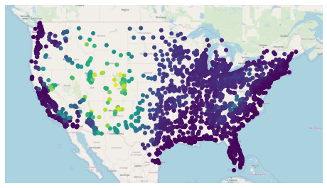
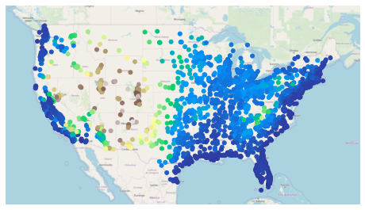
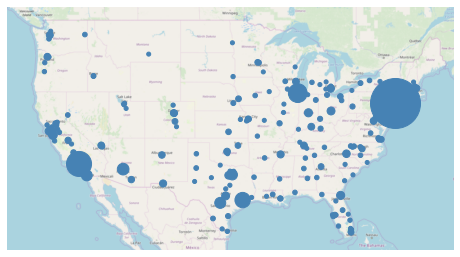
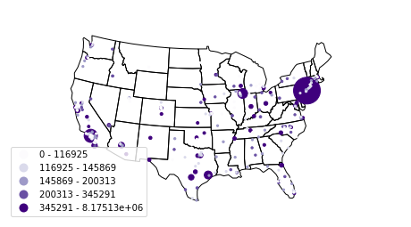
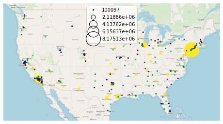
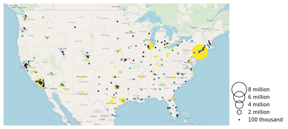
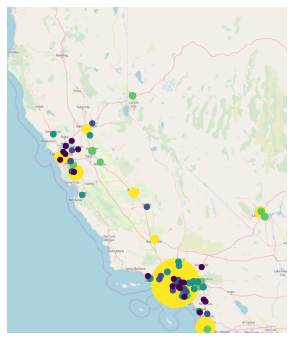
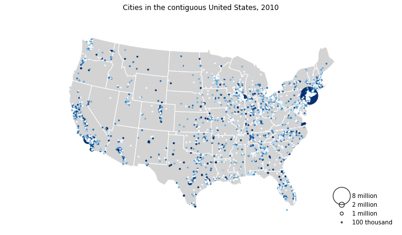

Customizing Plots
=================

``geoplot`` plots have a large number of styling parameters, both
cosmetic (for example, the colors of the map borders) and informative
(for example, the choice of colormap). This section of the tutorial
explains how these work.

You may follow along with this tutorial interactively using
`Binder <https://mybinder.org/v2/gh/ResidentMario/geoplot/master?filepath=notebooks/tutorials/Customizing_Plots.ipynb>`__.

Position
--------

A `visual
variable <https://wiki.gis.com/wiki/index.php/Visual_variable>`__ is an
attribute of a plot that is used to convey information. One such
variable that every map has in common is **position**.

.. code:: ipython3

    %matplotlib inline
    import geopandas as gpd
    import geoplot as gplt
    
    continental_usa_cities = gpd.read_file(gplt.datasets.get_path('usa_cities'))
    continental_usa_cities = continental_usa_cities.query('STATE not in ["AK", "HI", "PR"]')
    contiguous_usa = gpd.read_file(gplt.datasets.get_path('contiguous_usa'))

.. code:: ipython3

    import geoplot.crs as gcrs
    
    ax = gplt.webmap(contiguous_usa, projection=gcrs.WebMercator())
    gplt.pointplot(continental_usa_cities, ax=ax)

.. parsed-literal::

    <cartopy.mpl.geoaxes.GeoAxesSubplot at 0x12beeeda0>

.. image:: Customizing_Plots_files/Customizing_Plots_3_1.png

This plot shows cities in the continental United States with greater
than 10,000 population. It has only one visual variable, position. By
examining the distribution of the points, we see that the part of the
United States around the Rocky Mountains is more sparely populated than
the coasts.

Hue
---

The “hue” parameter in ``geoplot`` adds **color** as a visual variable
in your plot.

   This parameter is called “hue”, not “color”, because ``color`` is a
   reserved keyword in the ``matplotlib`` API.

.. code:: ipython3

    ax = gplt.webmap(contiguous_usa, projection=gcrs.WebMercator())
    gplt.pointplot(
        continental_usa_cities,
        hue='ELEV_IN_FT',
        ax=ax
    )

.. parsed-literal::

    <cartopy.mpl.geoaxes.GeoAxesSubplot at 0x12bfb88d0>

In this case we set ``hue='ELEV_IN_FT'``, telling ``geoplot`` to color
the points based on mean elevation.

There are two ways of assigning colors to geometries: a continuous
colormap, which just applies colors on a spectrum of data; or a
categorical colormap, which buckets data and applies colors not to those
buckets.

``geoplot`` uses a continuous colormap by default. To switch to a
categorical colormap, use the ``scheme`` parameter:

.. code:: ipython3

    import mapclassify as mc
    scheme = mc.Quantiles(continental_usa_cities['ELEV_IN_FT'], k=5)
    
    ax = gplt.webmap(contiguous_usa, projection=gcrs.WebMercator())
    gplt.pointplot(
        continental_usa_cities,
        hue='ELEV_IN_FT', scheme=scheme,
        ax=ax
    )

.. parsed-literal::

    /Users/alex/miniconda3/envs/geoplot-dev/lib/python3.6/site-packages/scipy/stats/stats.py:1633: FutureWarning: Using a non-tuple sequence for multidimensional indexing is deprecated; use `arr[tuple(seq)]` instead of `arr[seq]`. In the future this will be interpreted as an array index, `arr[np.array(seq)]`, which will result either in an error or a different result.
      return np.add.reduce(sorted[indexer] * weights, axis=axis) / sumval

.. parsed-literal::

    <cartopy.mpl.geoaxes.GeoAxesSubplot at 0x12bfddeb8>

.. image:: Customizing_Plots_files/Customizing_Plots_9_2.png

The `mapclassify <https://pysal.org/mapclassify/>`__ library has a rich
list of categorical colormaps to choose from. it is also possible to
specify your own custom classification scheme. Refer to the `California
districts
demo <https://residentmario.github.io/geoplot/gallery/plot_california_districts.html>`__
in the Gallery for more information.

``geoplot`` uses the ``viridis`` colormap by default. To specify an
alternative colormap, use the ``cmap`` parameter:

.. code:: ipython3

    ax = gplt.webmap(contiguous_usa, projection=gcrs.WebMercator())
    gplt.pointplot(
        continental_usa_cities,
        hue='ELEV_IN_FT', cmap='terrain',
        ax=ax
    )

.. parsed-literal::

    <cartopy.mpl.geoaxes.GeoAxesSubplot at 0x12c832d30>

There are `over fifty named
colormaps <https://matplotlib.org/3.1.0/tutorials/colors/colormaps.html>`__
in ``matplotlib``—`the reference page has the full
list <https://matplotlib.org/3.1.0/tutorials/colors/colormaps.html>`__.
It is also possible to create your own colormap. Refer to the
`Napoleon’s march on
Moscow <https://residentmario.github.io/geoplot/gallery/plot_minard_napoleon_russia.html>`__
example in the Gallery for an example.

**Power User Feature: Colormap Normalization**

`Colormap
normalization <https://matplotlib.org/users/colormapnorms.html>`__ is
supported in ``geoplot`` via the ``norm`` parameter.

Scale
-----

Another visual variable present in some plots in ``geoplot`` is
**scale**.

.. code:: ipython3

    large_continental_usa_cities = continental_usa_cities.query('POP_2010 > 100000')
    
    ax = gplt.webmap(contiguous_usa, projection=gcrs.WebMercator())
    gplt.pointplot(
        large_continental_usa_cities, projection=gcrs.AlbersEqualArea(),
        scale='POP_2010', limits=(4, 50),
        ax=ax
    )

.. parsed-literal::

    <cartopy.mpl.geoaxes.GeoAxesSubplot at 0x12dd552b0>

Scale uses the size of the feature to communication information about
its magnitude. For example in this plot we can see more easily than in
the ``hue``-based plots how much larger certain cities (like New York
City and Los Angeles) are than others.

You can adjust the minimum and maximum size of the of the plot elements
to your liking using the ``limits`` parameter.

**Power User Feature: Custom Scaling Functions**

   ``geoplot`` uses a linear scale by default. To use a different scale,
   like e.g. logarithmic, pass a scaling function to the ``scale_func``
   parameter. Refer to the `USA city
   elevations <https://residentmario.github.io/geoplot/gallery/plot_usa_city_elevations.html>`__
   demo in the Gallery for an example.

Legend
------

A `legend <http://wiki.gis.com/wiki/index.php/Map_legend>`__ provides a
reference on the values that correspond to the visual variables in your
plot. Legends are an important feature because they make your map
interpretable. Without a legend, you can only map visual variables to
relative magnitudes. With a legend, you can further map them to actual
ranges of values.

To add a legend to your plot, set ``legend=True``.

.. code:: ipython3

    import mapclassify as mc
    scheme = mc.Quantiles(large_continental_usa_cities['POP_2010'], k=5)
    
    ax = gplt.webmap(contiguous_usa, projection=gcrs.WebMercator())
    gplt.pointplot(
        large_continental_usa_cities, projection=gcrs.AlbersEqualArea(),
        scale='POP_2010', limits=(4, 50),
        hue='POP_2010', cmap='viridis', scheme=scheme,
        legend=True, legend_var='hue',
        ax=ax
    )

.. parsed-literal::

    /Users/alex/miniconda3/envs/geoplot-dev/lib/python3.6/site-packages/scipy/stats/stats.py:1633: FutureWarning: Using a non-tuple sequence for multidimensional indexing is deprecated; use `arr[tuple(seq)]` instead of `arr[seq]`. In the future this will be interpreted as an array index, `arr[np.array(seq)]`, which will result either in an error or a different result.
      return np.add.reduce(sorted[indexer] * weights, axis=axis) / sumval

.. parsed-literal::

    <cartopy.mpl.geoaxes.GeoAxesSubplot at 0x135c57e80>

The type of legend you will get depends on your configuration options.
There are three different kinds. This example demonstrates a
**categorical colormap legend**. If your colormap is continuous
(e.g. ``scheme=None``; see `the section on Hue <#Hue>`__), a
**continuous colorbar** will be used instead:

.. code:: ipython3

    ax = gplt.webmap(contiguous_usa, projection=gcrs.WebMercator())
    gplt.pointplot(
        large_continental_usa_cities, projection=gcrs.AlbersEqualArea(),
        scale='POP_2010', limits=(2, 30),
        hue='POP_2010', cmap='viridis',
        legend=True,
        ax=ax
    )

.. parsed-literal::

    /Users/alex/Desktop/geoplot/geoplot/geoplot.py:258: UserWarning: Please specify "legend_var" explicitly when both "hue" and "scale" are specified. Defaulting to "legend_var='hue'".
      f'Please specify "legend_var" explicitly when both "hue" and "scale" are '

.. parsed-literal::

    <cartopy.mpl.geoaxes.GeoAxesSubplot at 0x1347b5d30>

.. image:: Customizing_Plots_files/Customizing_Plots_20_2.png

Alternatively, set ``legend_var='scale'`` to use a **scale legend**
instead:

.. code:: ipython3

    ax = gplt.webmap(contiguous_usa, projection=gcrs.WebMercator())
    gplt.pointplot(
        large_continental_usa_cities, projection=gcrs.AlbersEqualArea(),
        scale='POP_2010', limits=(2, 30),
        hue='POP_2010', cmap='viridis', scheme=scheme,
        legend=True, legend_var='scale',
        ax=ax
    )

.. parsed-literal::

    <cartopy.mpl.geoaxes.GeoAxesSubplot at 0x13755dda0>

You can fine-tune the appearance of the legend using ``legend_kwargs``
parameter. **The list of values this parameter accepts depends on the
legend type**. In the case of a categorical colormap legend or a scale
legend, a ``matplotlib`` ``Legend`` is used, whose keyword options are
listed in `the matplotlib
documentation <https://matplotlib.org/3.1.0/api/_as_gen/matplotlib.pyplot.legend.html>`__.
In the case of a colorbar legend, the keyword parameters allowed are
listed in a different page in `the matplotlib
documentation <https://matplotlib.org/3.1.0/api/_as_gen/matplotlib.pyplot.colorbar.html>`__.

Here is an example using ``legend_kwargs`` parameters to reposition the
legend:

.. code:: ipython3

    ax = gplt.webmap(contiguous_usa, projection=gcrs.WebMercator())
    gplt.pointplot(
        large_continental_usa_cities, projection=gcrs.AlbersEqualArea(),
        scale='POP_2010', limits=(2, 30),
        hue='POP_2010', cmap='viridis', scheme=scheme,
        legend=True, legend_var='scale',
        legend_kwargs={'bbox_to_anchor': (1, 0.35), 'frameon': False},
        legend_values=[8000000, 6000000, 4000000, 2000000, 100000],
        legend_labels=['8 million', '6 million', '4 million', '2 million', '100 thousand'],
        ax=ax
    )

.. parsed-literal::

    <cartopy.mpl.geoaxes.GeoAxesSubplot at 0x13969c4a8>

This example also demonstrates the use of the ``legend_values`` and
``legend_labels`` parameters to customize the markers and labels in the
legend, respectively.

**Power User Feature: Custom Legend Markers**

   Keyword arguments to ``legend_kwargs`` that start with ``marker``
   (e.g. ``marker``, ``markeredgecolor``, ``markeredgewidth``,
   ``markerfacecolor``, and ``markersize``) `will be passed through the
   legend down to the legend
   markers <https://github.com/ResidentMario/geoplot/issues/35#issuecomment-507196579>`__.

Extent
------

The **extent** of a plot is the span of its axes. In ``geoplot`` it is
formatted as a tuple of
``(min_longitude, min_latitude, max_longitude, max_latitude)``. For
example, a plot covering the entire world would have a span of
``(-180, -180, 180, 180)``.

The ``extent`` argument can be used to set the extent of a plot
manually. This can be used to change the focus of a map. For example,
here’s a map of just populous cities in the state of California.

.. code:: ipython3

    import mapclassify as mc
    scheme = mc.Quantiles(large_continental_usa_cities['POP_2010'], k=5)
    
    extent = contiguous_usa.query('state == "California"').total_bounds
    ax = gplt.pointplot(
        large_continental_usa_cities, projection=gcrs.WebMercator(),
        scale='POP_2010', limits=(5, 100),
        hue='POP_2010', scheme=scheme, cmap='viridis'
    )
    gplt.webmap(
        contiguous_usa, ax=ax, extent=extent
    )

.. parsed-literal::

    /Users/alex/miniconda3/envs/geoplot-dev/lib/python3.6/site-packages/scipy/stats/stats.py:1633: FutureWarning: Using a non-tuple sequence for multidimensional indexing is deprecated; use `arr[tuple(seq)]` instead of `arr[seq]`. In the future this will be interpreted as an array index, `arr[np.array(seq)]`, which will result either in an error or a different result.
      return np.add.reduce(sorted[indexer] * weights, axis=axis) / sumval

.. parsed-literal::

    <cartopy.mpl.geoaxes.GeoAxesSubplot at 0x13edeb550>

The
`total_bounds <http://geopandas.org/reference.html#geopandas.GeoSeries.total_bounds>`__
property on a ``GeoDataFrame``, which returns the extent bounding box
values for a given chunk of data, is extremely useful for this purpose.

Cosmetic parameters
-------------------

Keyword arugments that are not interpreted as arguments to ``geoplot``
are instead passed directly to the underlying ``matplotlib`` chart
instance. This means that all of the usual ``matplotlib`` plot
customization options are there.

We won’t go over every single possible option here, but we will mention
the most common parameters you will want to tweak:

-  ``edgecolor``—Controls the color of the border lines.
-  ``linewidth``—Controls the width of the border lines.
-  ``facecolor``—Controls the color of the fill of the shape.

By combining all of the things we’ve learned thus far in this guide with
a few ``matplotlib`` customizations we can generate some very
pretty-looking plots:

.. code:: ipython3

    import geoplot.crs as gcrs
    import matplotlib.pyplot as plt
    import mapclassify as mc
    
    scheme = mc.Quantiles(continental_usa_cities['POP_2010'], k=5)
    proj = gcrs.AlbersEqualArea()
    
    ax = gplt.polyplot(
        contiguous_usa, 
        zorder=-1,
        linewidth=1,
        projection=proj,
        edgecolor='white',
        facecolor='lightgray',
        figsize=(12, 12)
    )
    
    gplt.pointplot(
        continental_usa_cities, 
        scale='POP_2010',
        limits=(2, 30),
        hue='POP_2010',
        cmap='Blues',
        scheme=scheme,
        legend=True,
        legend_var='scale',
        legend_values=[8000000, 2000000, 1000000, 100000],
        legend_labels=['8 million', '2 million', '1 million', '100 thousand'],
        legend_kwargs={'frameon': False, 'loc': 'lower right'},
        ax=ax
    )
    
    plt.title("Cities in the contiguous United States, 2010")

.. parsed-literal::

    /Users/alex/miniconda3/envs/geoplot-dev/lib/python3.6/site-packages/scipy/stats/stats.py:1633: FutureWarning: Using a non-tuple sequence for multidimensional indexing is deprecated; use `arr[tuple(seq)]` instead of `arr[seq]`. In the future this will be interpreted as an array index, `arr[np.array(seq)]`, which will result either in an error or a different result.
      return np.add.reduce(sorted[indexer] * weights, axis=axis) / sumval

.. parsed-literal::

    Text(0.5, 1.0, 'Cities in the contiguous United States, 2010')

